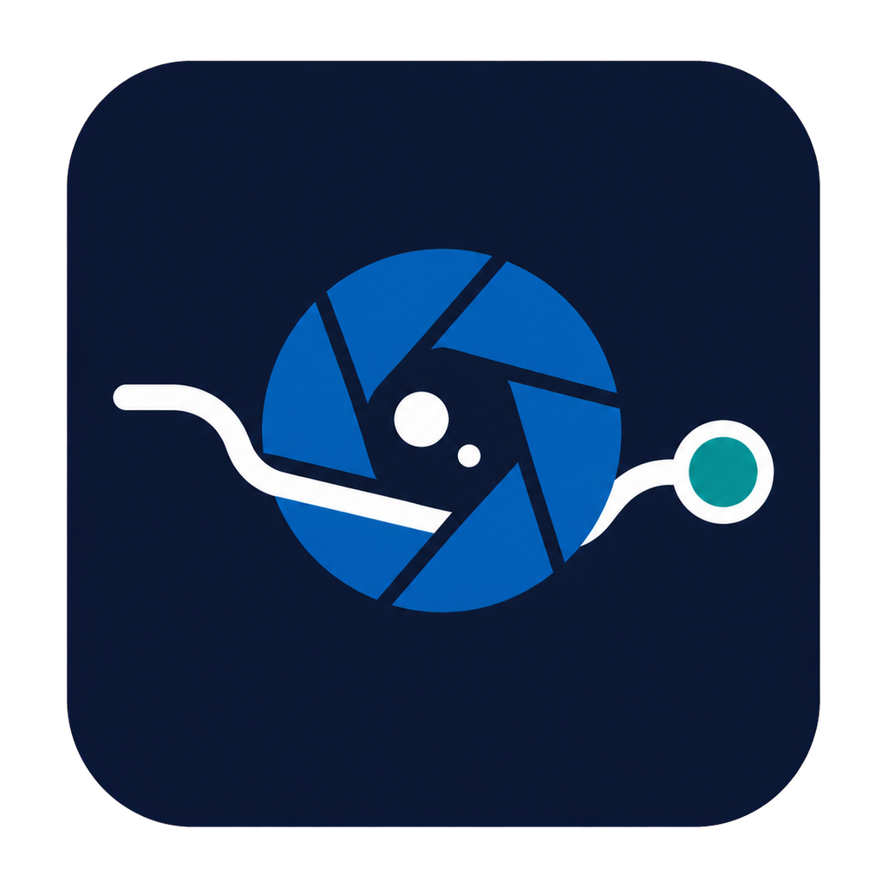
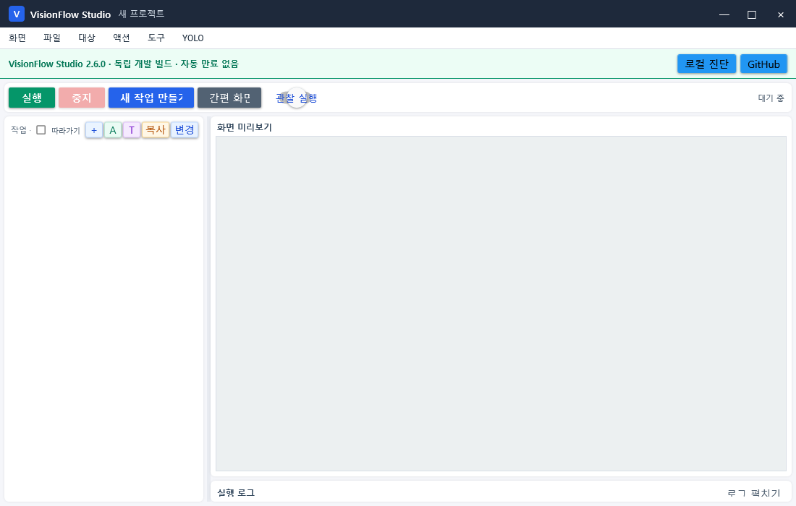

# VisionFlow Studio Distribution

  

이 저장소는 **VisionFlow Studio의 최신 공개 배포 허브**이자 **YoloMacro 레거시 배포 보관소**, 그리고 두 제품의 **통합 웹 인증 관리 저장소**입니다.

[공개 다운로드 페이지](https://ko9ma7.github.io/YoloMacro-Distribution/) · [VisionFlow Studio 2.6.0 릴리스](https://github.com/ko9ma7/YoloMacro-Distribution/releases/tag/v2.6.0) · [통합 인증 운영](docs/UNIFIED_WEB_ACTIVATION.md) · [English](README.en.md)

## 제품 구분

| 제품 | 상태 | 공개 버전 | 다운로드 | 인증 정책 |
|---|---|---:|---|---|
| **VisionFlow Studio** | 현재 개발·배포 제품 | **2.6.0** | [전체 ZIP](https://github.com/ko9ma7/YoloMacro-Distribution/releases/download/v2.6.0/VisionFlow-Studio-v2.6.0-win-x64.zip) | [`visionflow-studio.json`](activation/visionflow-studio.json) |
| YoloMacro | 레거시 유지 제품 | 1.4.6 | [전체 ZIP](https://github.com/ko9ma7/YoloMacro-Distribution/releases/download/v1.4.6/YoloMacro-v1.4.6-win-x64.zip) | [`yolomacro.json`](activation/yolomacro.json) |

새 프로젝트와 새 설치에는 VisionFlow Studio를 권장합니다. 기존 YoloMacro 프로젝트와 설치는 레거시 1.4.x 배포선으로 계속 유지합니다.

## VisionFlow Studio 2.6.0

VisionFlow Studio는 YoloMacro의 비전 자동화 기능과 프로젝트 형식을 계승하면서 작업 생성과 설정 구조를 다시 정리한 최신 Windows 비전 RPA 제품입니다.

- 캡처한 이미지를 기본적으로 `OpenCV 이미지 찾기 → 좌클릭` 작업으로 등록
- 작은 프로그램 창에서도 사용할 수 있는 Compact 작업 설정
- 보조 기능을 체크한 뒤 버튼으로 여는 오버레이 설정
- 오버레이에서 `Esc`로 닫기, `Enter`로 적용하고 바깥에서는 전체 취소·저장
- 기능 찾기, 기능 카탈로그, 목적 기반 새 작업 생성
- 다중 패턴·회전·크기 변화·점진 투명화에 대응하는 장기 대상 추적
- OpenCV, YOLO, AOI, OCR, 대표 이미지 사전과 조건 분기
- 관찰 실행, 프로젝트 안전 검사, Replay와 복구 기능
- 자동 만료 없이 웹에서만 회전·중지하는 schema 3 실행 채널

전체 변경 내용은 [VisionFlow Studio 2.6.0 릴리스 노트](docs/VISIONFLOW_STUDIO_2.6.0.md)에 정리했습니다.

## 설치

1. [VisionFlow Studio 2.6.0 릴리스](https://github.com/ko9ma7/YoloMacro-Distribution/releases/tag/v2.6.0)에서 전체 ZIP을 받습니다.
2. ZIP을 새 폴더에 모두 풉니다.
3. `.NET 8 Desktop Runtime`이 설치된 Windows에서 `VisionFlowStudio.exe`를 실행합니다.
4. 상단 상태에서 설치 버전 `2.6.0`, `vfs-*` 관리 채널과 웹 정책 확인 완료 상태를 확인합니다.
5. 실제 입력 전에는 `관찰 실행`으로 탐지·분기·추적 흐름을 먼저 확인합니다.

DLL 하나만 교체하지 말고 ZIP 전체를 사용하세요. OCR 언어 데이터, ONNX Runtime, OpenCV 네이티브 파일과 서명 정책 영수증이 함께 배포됩니다.

## 웹 전용 인증

서명 개인키와 `ACTIVATION_SIGNING_KEY_PEM` Secret은 이 저장소에만 있습니다. 앱과 소스 저장소에는 검증용 공개키만 포함합니다.

- 관리: **Actions → Unified web activation management**
- `publish`: 현재 정책 재서명·게시
- `rotate`: 새 관리 채널 발급, 이전 빌드 잠금
- `enable` / `disable`: 제품 실행 허용 또는 중지
- 자동 만료 없음: 채널을 바꾸거나 중지하지 않으면 계속 사용 가능
- 제품 분리: `visionflow-studio`와 `yolomacro`는 서로의 정책을 사용할 수 없음

[VisionFlow 정책](activation/visionflow-studio.json) · [YoloMacro 정책](activation/yolomacro.json) · [공개키](activation/public-key.pem) · [관리 이력](activation/history.json)

## YoloMacro 레거시

YoloMacro는 과거 1.4.x 프로젝트를 유지하기 위한 레거시 제품입니다. 공개 문서와 기존 릴리스는 계속 보존하지만 새 기능의 기준은 VisionFlow Studio입니다.

- [YoloMacro 1.4.6 릴리스](https://github.com/ko9ma7/YoloMacro-Distribution/releases/tag/v1.4.6)
- [YoloMacro 1.4.6 릴리스 노트](docs/YOLOMACRO_1.4.6.md)
- [YoloMacro 사용자 설명서](docs/USER_MANUAL.md)
- [YoloMacro 1.4.x 릴리스 기록](RELEASE_NOTES.md)
- [제품 유지 경계](FROZEN.md)

## 저장소 역할

| 저장소 | 역할 |
|---|---|
| `ko9ma7/VisionFlow-Studio` | VisionFlow Studio 비공개 소스·테스트·빌드 |
| `ko9ma7/YoloMacro` | YoloMacro 레거시 비공개 소스 |
| `ko9ma7/YoloMacro-Distribution` | 두 제품의 공개 패키지·문서·Pages·서명 정책과 인증 Action |

고객 이미지, 프로젝트, 데이터셋, API 키, 토큰 또는 서명 개인키를 공개 저장소에 올리지 마세요.
