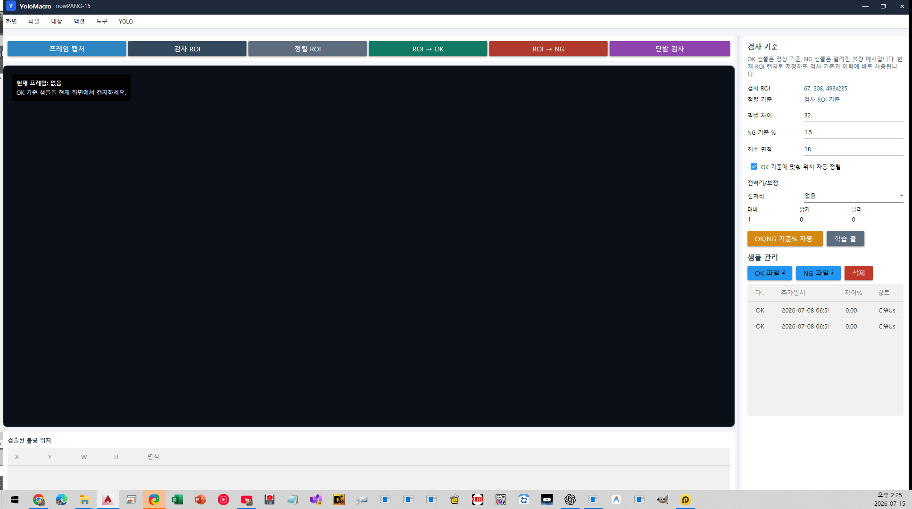
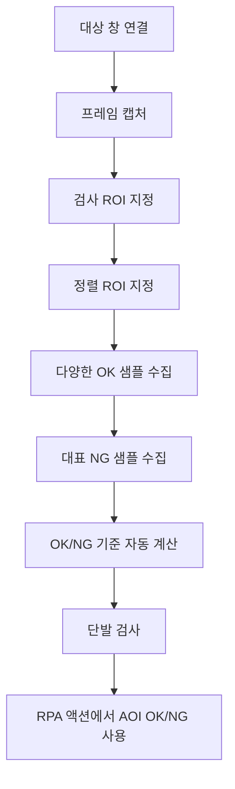

# AOI 학습과 검사 가이드

AOI는 고정된 제품이나 UI의 정상 화면과 현재 화면을 비교해 작은 차이와 불량 위치를 찾는 기능입니다. YOLO처럼 객체 이름을 학습하는 방식이 아니라 정상 기준과 픽셀 차이를 사용합니다.



## AOI가 적합한 경우

- 제품의 찍힘, 누락, 얼룩, 파손을 고정 카메라에서 검사
- 동일한 UI에서 특정 아이콘이나 숫자 영역이 깨졌는지 확인
- 정상품과 거의 같은 위치·크기의 대상 비교
- 불량의 위치와 면적을 사각형으로 확인

대상 위치와 크기가 크게 달라지거나 여러 종류의 물체를 찾아야 한다면 YOLO가 더 적합합니다.

## 전체 작업 흐름



## 1. 환경 고정

AOI 정확도는 촬영 조건의 일관성에 크게 좌우됩니다.

- 대상 창 크기와 배율을 고정합니다.
- 카메라라면 위치, 초점, 노출과 조명을 고정합니다.
- 검사 대상이 놓이는 방향을 일정하게 합니다.
- 움직임이 멈춘 뒤 캡처하도록 딜레이를 둡니다.
- 마우스 호버로 화면 색이 바뀐다면 캡처 전 호버 해제를 사용합니다.

## 2. 프레임 캡처

1. `AOI 학습` 탭을 엽니다.
2. 검사할 정상 화면을 대상 창에 표시합니다.
3. `프레임 캡처`를 누릅니다.
4. 왼쪽 미리보기와 현재 프레임 정보를 확인합니다.

캡처가 검거나 비어 있으면 설정 탭에서 PrintWindow, RenderFullContent, BitBlt 또는 CopyFromScreen을 차례로 시험합니다.

## 3. 검사 ROI 지정

`검사 ROI`는 실제 불량을 찾을 범위입니다.

1. `검사 ROI`를 누릅니다.
2. 현재 프레임에서 검사할 부분만 드래그합니다.
3. 오른쪽 `검사 ROI` 좌표를 확인합니다.

ROI가 작을수록 배경 변화가 줄고 검사 속도가 빨라집니다. 제품 외부의 시계, 애니메이션, 커서, 그림자 영역은 제외하세요.

## 4. 정렬 ROI 지정

샘플마다 대상이 몇 픽셀씩 움직일 수 있다면 `정렬 ROI`를 지정합니다.

- 모서리, 로고, 고정 홀처럼 형태가 선명한 위치를 선택합니다.
- 불량이 자주 생기는 위치 자체는 정렬 기준으로 피합니다.
- `OK 기준에 맞춰 위치 자동 정렬`을 켭니다.

위치가 완전히 고정돼 있다면 정렬을 끄고 비교 결과를 확인할 수도 있습니다.

## 5. OK 샘플 수집

1. 정상 제품이나 정상 화면을 표시합니다.
2. `프레임 캡처`를 누릅니다.
3. `ROI → OK`를 누릅니다.
4. 조명·노이즈·정상 편차를 포함하도록 여러 장을 반복 수집합니다.

좋은 OK 샘플은 모두 정상이어야 하지만 현실적인 정상 변동을 포함해야 합니다. 한 장만 사용하면 작은 밝기 변화도 NG로 판단하기 쉽습니다.

이미 저장된 정상 이미지는 `OK 파일 추가`로 가져올 수 있습니다.

## 6. NG 샘플 수집

1. 실제로 잡아야 할 대표 불량을 준비합니다.
2. 프레임을 캡처합니다.
3. `ROI → NG`를 누릅니다.
4. 누락, 얼룩, 위치 틀어짐 등 서로 다른 불량 유형을 추가합니다.

기존 파일은 `NG 파일 추가`로 가져옵니다. 샘플 표에는 라벨, 추가 시각, 최근 차이율과 경로가 표시됩니다.

## 7. 검사 기준 이해하기

| 설정 | 의미 | 조정 방향 |
|---|---|---|
| 픽셀 차이 | 한 픽셀이 다르다고 볼 밝기/색 차이 | 올리면 미세 차이를 덜 민감하게 봄 |
| NG 기준 % | ROI 전체에서 다른 픽셀 비율 | 올리면 더 큰 차이만 NG |
| 최소 면적 | 결함 덩어리로 인정할 최소 크기 | 올리면 작은 노이즈 제거 |
| 자동 정렬 | OK 기준과 현재 화면 위치 보정 | 작은 위치 흔들림이 있을 때 켬 |

초기값은 픽셀 차이 32, NG 기준 1.5%, 최소 면적 18입니다. 이것은 출발점이며 실제 샘플 분포에 맞춰 조정해야 합니다.

## 8. 전처리와 보정

| 전처리 | 사용 시점 |
|---|---|
| 없음 | 환경이 안정적이고 원본 차이가 명확함 |
| 밝기 정규화 | 전체 조명이 조금씩 변함 |
| 히스토그램 평활화 | 명암 대비가 낮거나 분포가 변함 |
| 노이즈 완화 | 카메라 센서 잡음과 미세 점이 많음 |
| 선명화 | 경계가 흐리고 결함 윤곽이 약함 |
| Otsu 이진화 | 명확한 전경/배경 두 영역으로 나뉨 |

추가 보정:

- 대비: 1.0이 기본, 올리면 차이를 강조
- 밝기: 전체 픽셀에 더하거나 빼는 값
- 블러: 작은 노이즈를 줄이지만 작은 결함도 사라질 수 있음

한 번에 여러 값을 크게 바꾸지 말고 전처리 하나를 선택한 뒤 단발 검사 결과를 비교하세요.

## 9. 기준 자동 계산

OK와 NG 샘플을 충분히 모은 뒤 `F1 기준 자동 보정`을 누릅니다. 각 OK 샘플을 평가할 때 해당 샘플을 정상 기준 평균에서 제외하므로, 학습 샘플이 자기 자신과 비교되어 차이가 지나치게 낮아지는 누수를 막습니다. OK/NG 점수 분포가 겹치면 모든 후보 임계값을 비교해 F1이 가장 높은 값을 고르고 정밀도·재현율·분리 상태를 함께 표시합니다.

`OK 샘플의 정상 변동을 픽셀별 허용`을 켜고 OK 샘플을 3장 이상 모으면, 위치마다 반복되는 조명·재질 변화를 정상 허용치로 학습합니다. 오른쪽 배수는 보통 `2.0~4.0`에서 사용합니다. 값을 높이면 정상 변동에 관대해지고, 낮추면 작은 차이에 민감해집니다.

자동 계산 후에도 다음을 확인해야 합니다.

- 모든 OK가 기준 아래인가?
- 중요한 NG가 기준 위인가?
- 경계에 너무 가까운 샘플이 많은가?
- 실제 운영 조명에서 같은 결과가 나오는가?

## 10. 단발 검사

1. 검사할 새 화면을 표시합니다.
2. `프레임 캡처`를 누릅니다.
3. `단발 검사`를 누릅니다.
4. 결과 문구, 차이율과 검출된 불량 위치 표를 확인합니다.

불량 위치 표의 X, Y, W, H, 면적은 검사 ROI 안에서 검출된 연결 영역을 나타냅니다.

## 11. RPA 액션에 AOI 연결

1. RPA 실행 탭에서 액션을 추가합니다.
2. 액션 설정의 판정 엔진을 AOI로 선택합니다.
3. 기대 결과를 OK 또는 NG로 지정합니다.
4. AOI 학습과 같은 검사 ROI와 프로필을 사용합니다.
5. OK/NG 발견 결과에 맞춰 클릭, 점프, 정지 또는 알림을 설정합니다.
6. 관찰 실행으로 판정과 분기를 확인합니다.

예시:

```text
AOI 결과 OK  → 다음 제품 처리
AOI 결과 NG  → 경고 웹훅 → 불량 처리 항목 → 정지
```

## 12. 결과별 조정 방법

### 정상인데 NG로 판단

- OK 샘플을 더 다양하게 추가
- 정렬 ROI와 자동 정렬 확인
- 픽셀 차이 또는 NG 기준 %를 조금 높임
- 밝기 정규화 또는 노이즈 완화 적용
- 배경 변화가 있는 부분을 ROI에서 제외

### 불량인데 OK로 판단

- 해당 불량 NG 샘플 추가
- 픽셀 차이 또는 NG 기준 %를 낮춤
- 최소 면적을 낮춤
- 블러가 너무 강한지 확인
- 결함이 포함되도록 검사 ROI 수정

### 불량 위치가 너무 많이 나옴

- 최소 면적을 높임
- 노이즈 완화 적용
- OK 기준 이미지를 다시 캡처
- 정렬 오차와 조명 반사를 제거

## AOI 완료 점검표

- [ ] 검사 ROI가 필요한 영역만 포함한다.
- [ ] 정렬 기준은 고정된 특징을 사용한다.
- [ ] OK 샘플이 정상 변동을 포함한다.
- [ ] 중요한 NG 유형을 모두 넣었다.
- [ ] 자동 계산 후 실제 신규 샘플로 단발 검사했다.
- [ ] 불량 위치와 면적이 실제 결함을 가리킨다.
- [ ] RPA 관찰 실행에서 OK/NG 분기가 맞다.
- [ ] 운영 환경의 조명과 대상 크기가 유지된다.
