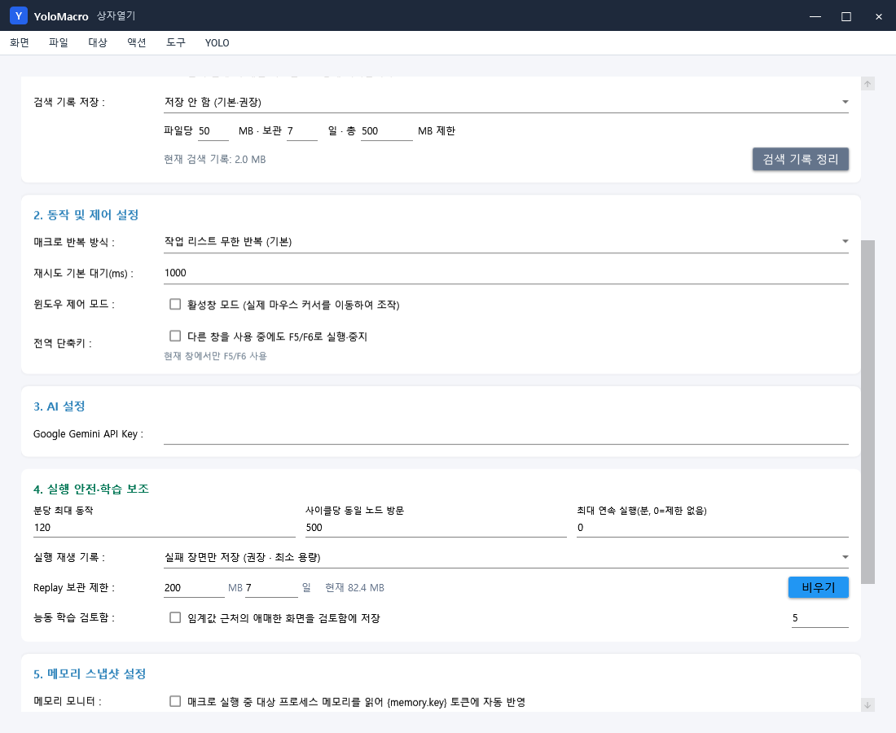

# 일괄 설정·창 복구·Replay 관리 (v1.3.0)

YoloMacro 1.3.0은 반복 액션의 설정을 빠르게 맞추되 이미지 파일과 검색 범위는 각 액션별로 유지하고, 창이 화면 밖이나 투명 상태에 남는 문제와 Replay 폴더의 무제한 증가를 함께 해결합니다.

## 여러 액션의 설정만 한 번에 바꾸기

1. 작업 목록에서 `Ctrl+클릭`으로 액션을 하나씩 고르거나 `Shift+클릭`으로 연속 범위를 선택합니다.
2. 설정 기준으로 사용할 액션을 마우스 오른쪽 버튼으로 누릅니다. 우클릭한 액션이 기준이 되고 나머지가 적용 대상이 됩니다.
3. `기준 액션에서 설정 그룹 복사`를 누릅니다. 작업 목록 위의 `복사` 버튼이나 `액션` 메뉴에서도 열 수 있습니다.
4. 필요한 그룹만 체크하고 `대상에 적용`을 누릅니다.

| 설정 그룹 | 복사하는 값 | 복사하지 않는 값 |
|---|---|---|
| 다중 이미지 조건만 | 단일·AND·OR 조건 | 기본 이미지 이름, 다중 이미지 파일 목록 |
| 이미지 매칭 설정만 | 임계값, 탐색 방식, 전처리, 색상·배경 무시, 안정성, AOI·게이지 판정 기준 | 이미지 이름, ROI, 결과 키, YOLO 대상 클래스, AOI 프로필 키 |
| 대기·중복 방지·재시도만 | 전후 대기, 스마트 대기, 쿨다운, 사라짐 확인, 응답 검증, 재시도와 실패 대체 대상 | 마우스·키 입력, 이미지 이름 |
| 마우스 및 기타 액션 설정만 | 기본 동작의 클릭·드래그·휠·키 입력, 좌표, 랜덤 범위, 웹훅, 입력 방식 | 추가 액션 시퀀스, 이미지 판정과 흐름 |
| 흐름만 | 찾음·실패·AI 분기, 점프, 활성화·비활성화, 반복 | 이미지·입력 설정 |

일괄 복사에서는 `ImageName`, `MultiImageNames`, `ROI`를 코드 수준에서 제외합니다. 따라서 로그인·확인·닫기 버튼처럼 서로 다른 이미지를 사용하는 액션도 같은 임계값이나 재시도 정책만 안전하게 맞출 수 있습니다.

## 프로그램 창이 사라졌을 때

프로그램을 다시 열면 저장된 위치와 크기를 현재 연결된 모니터의 작업 영역 안으로 자동 보정합니다. 모니터를 분리하거나 해상도·배율을 바꿔도 실행 중인 창을 다시 화면 안으로 이동합니다.

즉시 초기화하려면 `도구 > 프로그램 창 위치 초기화`를 누릅니다. 창이 주 모니터 중앙의 기본 크기로 돌아옵니다.

화면 캡처, ROI 지정, 드래그 위치 지정, 타겟 선택용 전체 화면 오버레이에서 오류가 발생해도 `finally` 복구 경로가 프로그램 창을 다시 표시합니다.

## 대상 창 투명 보관을 안전하게 쓰기

- 기본적으로는 `대상 > 대상 창 마지막 모니터 보관 (안정)`을 권장합니다.
- `대상 창 투명 보관 (실험)`은 `CopyFromScreen` 캡처에서는 사용할 수 없습니다.
- YoloMacro 자체 창을 대상으로 투명 처리하는 동작은 차단됩니다.
- 투명 처리 후 캡처가 검게 나오면 즉시 원래 상태로 되돌립니다.
- 새 프로젝트, 다른 프로젝트 열기, 새 대상 선택, 정상 종료, 처리되지 않은 예외 발생 시 투명 처리했던 정확한 창 핸들의 스타일과 알파 값을 복구합니다.

대상 창을 직접 조작해야 할 때는 `대상 > 대상 창 원래 위치로 복원`을 사용합니다.

## Replay 폴더 용량 관리

`설정 > 실행 안전·학습 보조`에서 다음을 조정할 수 있습니다.

- `실패 장면만 저장`: 새 설치의 권장 기본값입니다. 정상 매칭 화면은 저장하지 않고 같은 실패도 60초 간격으로 제한합니다. ROI가 있으면 전체 화면 대신 ROI 주변만 저장합니다.
- `상태 변화와 장시간 실패 저장`: 성공/실패 전환 장면까지 분석해야 할 때 사용합니다.
- `저장 안 함`: Replay가 필요하지 않을 때 사용합니다.
- `Replay 보관 제한`: 현재 프로젝트 Replay 폴더의 이미지와 JSONL을 합친 전체 용량입니다. 기본값은 200MB입니다.
- `보관 일수`: 기본값은 7일입니다.
- `비우기`: 현재 프로젝트의 Replay만 삭제하고 프로젝트 파일과 매크로 이미지는 유지합니다.

기록은 `Replay/session-날짜-시간/frames`와 같은 실행별 폴더에 저장됩니다. 실행 시작 시 만료된 세션과 이미지가 이미 사라진 기존 JSONL 행을 정리하고, 전체 제한을 넘으면 오래된 세션부터 삭제합니다. 실행 중에는 100건 또는 약 10MB가 추가될 때만 정리하여 매 프레임 전체 폴더를 다시 검색하던 부하도 줄였습니다.

기존 설정 파일에 `StateChangesAndFailures`가 저장되어 있으면 그 선택은 유지됩니다. 용량을 최소화하려면 설정 화면에서 `실패 장면만 저장`으로 한 번 변경하세요.

## 권장 운용값

- 일반 자동화: 실패 장면만, 100~200MB, 7일
- 간헐 장애 분석: 상태 변화와 장시간 실패, 300~500MB, 14일
- 장시간 무인 운용: 실패 장면만, 100MB, 3~7일
- 개인정보가 화면에 포함되는 작업: 저장 안 함 또는 짧은 기간을 사용하고 Replay 폴더 접근 권한을 제한
