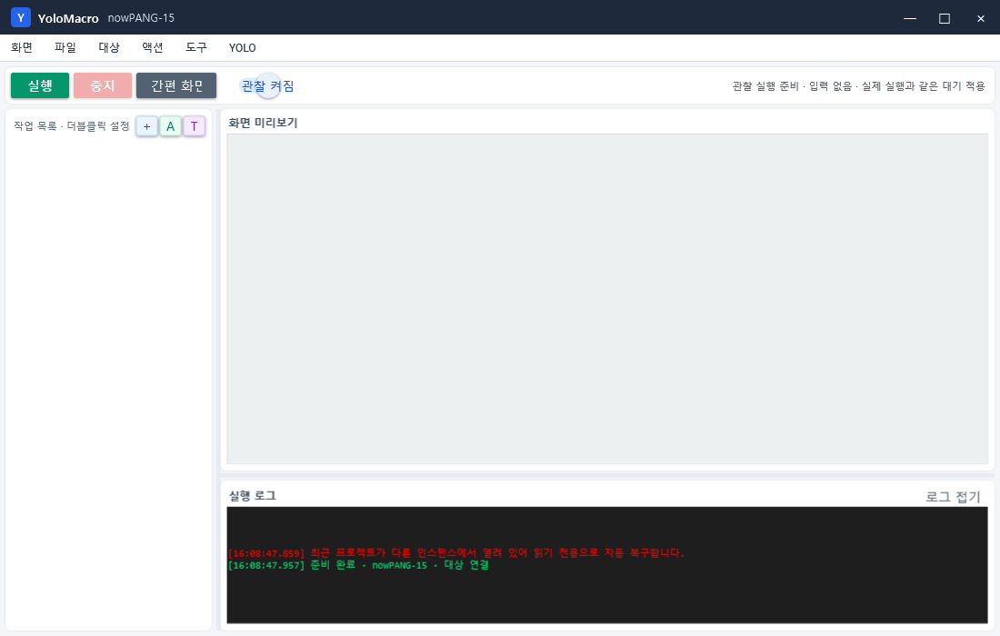

# 관찰 실행과 속도 개선 안내 (v1.2.1)

## 관찰 실행은 무엇인가요?

관찰 실행은 매크로를 실제로 조작하기 전에 화면 찾기와 분기 흐름을 안전하게 확인하는 미리보기입니다.

| 기능 | 관찰 실행 | 실제 실행 |
|---|---:|---:|
| 화면 캡처와 이미지/YOLO/AOI 판정 | 실행 | 실행 |
| 작업 목록의 현재 항목 표시 | 실행 | 실행 |
| 분기, 점프, 반복 흐름 확인 | 실행 | 실행 |
| 액션 전·후 대기 | 실행 | 실행 |
| 마우스와 키보드 입력 | 차단 | 실행 |
| 웹훅, AI 화면 전송, 메모리 조작, DLL 인젝션 | 차단 | 설정에 따라 실행 |

즉, v1.2.1부터는 **속도까지 실제 실행과 같게 유지하면서 위험한 외부 동작만 보내지 않습니다.**

상단의 `관찰 실행`을 누르면 `관찰 켜짐`으로 바뀝니다. 그 상태에서 `실행`을 누르면 현재 검사 항목은 왼쪽 작업 목록에서 계속 확인할 수 있고, 오른쪽 상태에는 입력이 차단된 관찰 실행임을 표시합니다.

## 너무 빠르게 보였던 이유

v1.2.0에서는 관찰 모드가 실제 입력을 생략하면서 액션의 `동작 후 대기`까지 함께 생략했습니다. 그래서 기본 500ms 대기가 설정된 액션도 즉시 다음 항목으로 넘어갔습니다. 또한 빠른 순회마다 작업 목록 선택과 자동 스크롤을 UI에 요청해 CPU 사용과 화면 깜빡임을 키웠습니다.

v1.2.1은 다음처럼 고쳤습니다.

1. 관찰 모드에서도 액션의 `동작 전 대기`와 `동작 후 대기`를 모두 유지합니다.
2. 실제 마우스·키보드 호출은 계속 0회로 유지합니다.
3. 현재 항목 표시는 최신 항목만 100ms마다 반영해 목록이 지나치게 흔들리지 않게 합니다.

## 딜레이 설정 구분

- `동작 전 대기`: 해당 액션을 실행하기 전에 기다리는 시간입니다.
- `동작 후 대기`: 해당 액션이 실행된 것으로 판단한 뒤 다음 흐름으로 넘어가기 전에 기다리는 시간입니다. 기본값은 500ms입니다.
- `검색 사이클 대기`: 전체 목록 한 바퀴가 끝나고 다음 검색 사이클을 시작하기 전에 기다리는 시간입니다. 개별 액션 대기를 대신하지 않습니다.
- `기본 대기`: `다시 시도` 흐름에 사용하는 전역 대기입니다.

## 검증

- Release 빌드: 경고 0, 오류 0
- 관찰 실행 회귀 테스트: 캡처 수행, 입력 호출 0회
- 300ms 동작 후 대기 회귀 테스트: 실제 경과 250ms 이상 확인
- 폴더 흐름, 프로젝트 격리, 템플릿 참조, 업데이트 안전성 등 전체 워크플로 회귀 테스트 통과

## 과거 버전 보관

기존 `distribution/v1.0.2`부터 `distribution/v1.0.12`, `distribution/releases/v1.0.13`, `distribution/releases/v1.1.0` 자료는 삭제하거나 덮어쓰지 않습니다. Git 태그와 GitHub Releases도 과거 버전을 그대로 유지하므로 언제든 이전 버전으로 돌아갈 수 있습니다.
