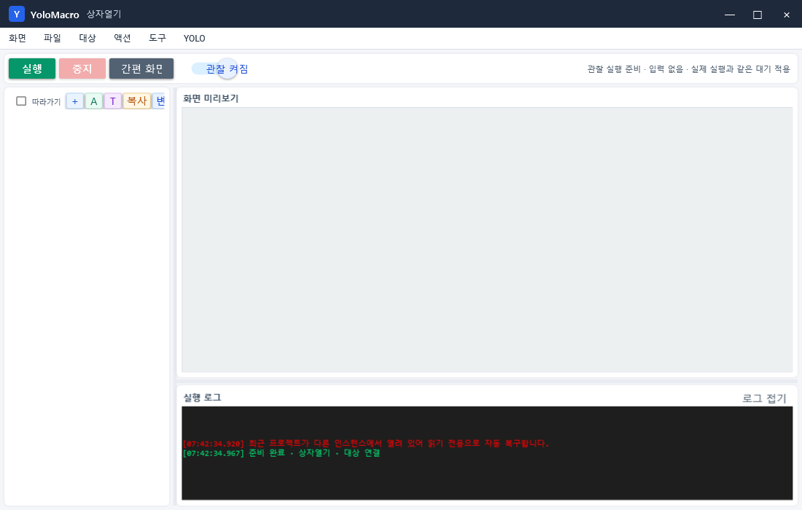
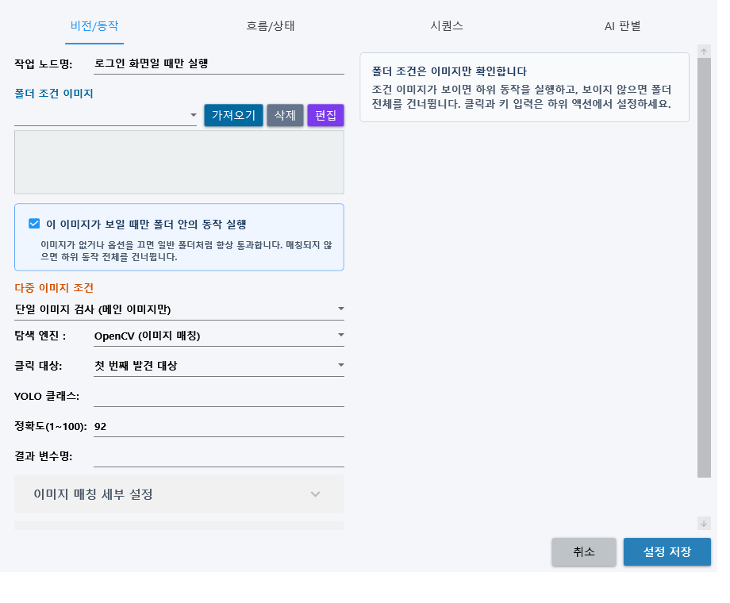
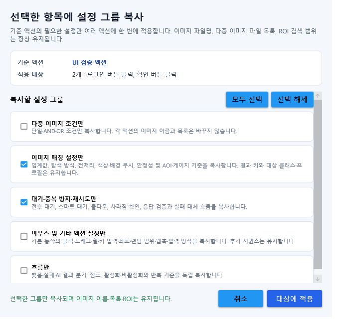
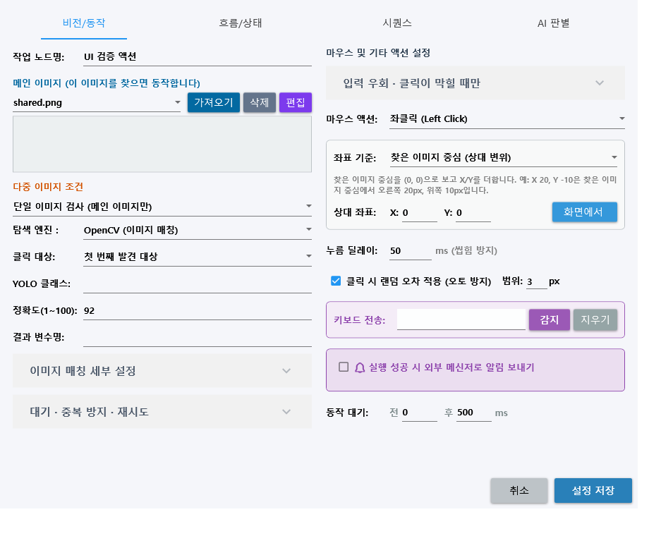
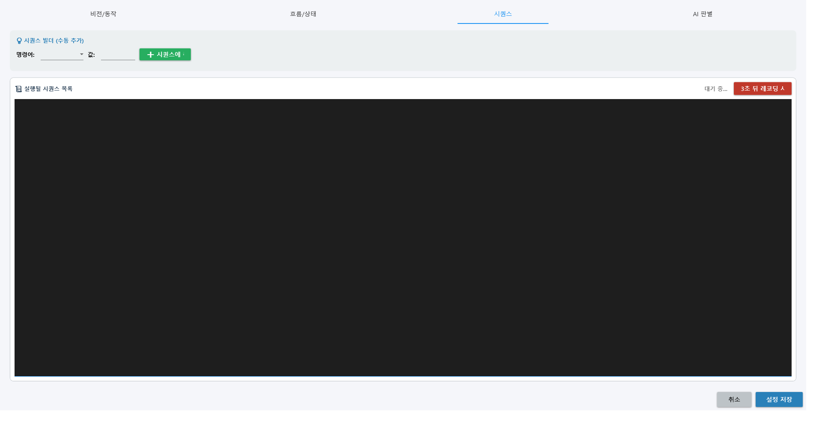
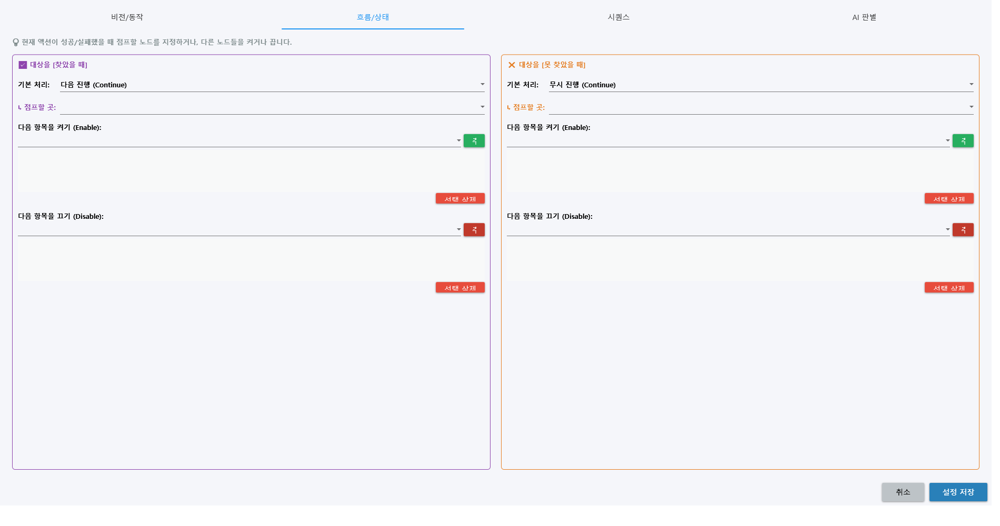

# RPA 실행 완전 가이드

이 문서는 새 프로젝트를 만들고 화면을 찾은 뒤 마우스·키보드 입력과 분기를 실행하는 전체 과정을 설명합니다.

## 1. 프로젝트 만들기

1. `파일 → 새 프로젝트`를 선택합니다.
2. 프로젝트 이름과 저장 위치를 정합니다.
3. 프로젝트가 만들어지면 프로젝트 전용 작업 공간과 `Images`, 백업, 실행 기록 폴더가 준비됩니다.
4. 기존 프로젝트를 수정할 때는 `열기`, 별도 사본을 만들 때는 `다른 이름으로 저장`을 사용합니다.

프로젝트 JSON에는 대상 창 조건, 작업 트리, 액션, 분기와 좌표가 저장됩니다. 캡처 이미지는 프로젝트의 이미지 폴더에 격리됩니다. 다른 프로젝트의 같은 파일명과 섞이지 않습니다.

## 2. 대상 창 연결하기

1. 자동화할 프로그램을 먼저 실행합니다.
2. YoloMacro에서 `대상 → 타겟 설정`을 선택합니다.
3. 목록에서 대상 창을 지정합니다.
4. 복잡한 앱플레이어나 자식 렌더링 창을 사용하는 프로그램은 `타겟 상세 조건`에서 제목, 프로세스명, 클래스명과 자식 창 조건을 확인합니다.
5. `대상 진단`으로 부모 HWND, 입력 HWND, 클라이언트 크기와 오프셋이 맞는지 로그에서 확인합니다.

대상 일치 방식:

| 방식 | 사용 시점 |
|---|---|
| 정확한 제목 | 창 제목이 절대 바뀌지 않을 때 |
| 제목 포함 | 문서명·서버명 등이 제목 뒤에 붙을 때 |
| 프로세스명 | 제목이 자주 바뀌지만 실행 파일이 일정할 때 |
| 클래스명 | 일반적인 제목/프로세스 선택으로 자식 창을 구분하기 어려울 때 |
| 제목 포함 + 클래스 | 앱플레이어처럼 비슷한 창이 여러 개일 때 |

대상 창을 화면 밖에 안정적으로 보관하려면 `대상 창 마지막 모니터 보관`, 다시 보이려면 `원래 위치로 복원`을 사용합니다. 투명 보관은 호환성을 확인한 뒤 사용합니다.

## 3. 작업 목록 만들기

작업 목록 위에는 빠른 작업 버튼이 있습니다.

- `+`: 폴더 추가
- `A`: 액션 추가
- `T`: 로직 템플릿 추가
- `복사`: 기준 액션의 선택 설정 그룹을 다른 선택 액션에 복사
- `변경`: 선택 액션에서 체크한 필드 값만 일괄 변경

항목을 더블클릭하면 설정 창이 열립니다. 여러 항목을 계층으로 묶을 때 폴더를 사용합니다. 폴더에 조건 이미지를 지정하면 이미지가 보일 때만 하위 작업이 실행되고, 보이지 않으면 폴더 하위 전체를 건너뜁니다.

작업 목록 조작:

- 체크박스: 실행 포함/제외
- 드래그: 순서 이동
- 우클릭: 설정, 이미지 캡처, ROI, 테스트 실행, 복사·삭제
- 다중 선택: 함께 이동하거나 삭제
- `▶`: 현재 검사 중인 항목
- `따라가기`: 켰을 때만 현재 항목으로 자동 스크롤

### 여러 액션의 기준값만 맞추기

`Ctrl+클릭` 또는 `Shift+클릭`으로 여러 액션을 선택하고, 기준으로 사용할 액션을 우클릭해 `선택 항목에 설정 그룹 복사`를 엽니다. 다중 이미지 조건, 이미지 매칭, 대기·재시도, 입력 액션, 흐름 중 필요한 그룹만 선택할 수 있습니다. 각 액션의 이미지 이름·다중 이미지 파일 목록·ROI는 덮어쓰지 않습니다.

자세한 범위와 Replay 관리 방법은 [일괄 설정·창 복구·Replay 관리](BATCH_SETTINGS_AND_REPLAY_1.3.0.md)를 참고하세요.

## 4. 화면 이미지와 ROI 만들기

가장 일반적인 OpenCV 액션 제작 순서입니다.

1. 액션을 추가합니다.
2. 액션 우클릭 후 `이미지 캡처/재촬영`을 선택합니다.
3. 대상 화면에서 찾고 싶은 버튼이나 아이콘을 드래그합니다.
4. 저장된 이미지를 액션 설정의 기준 이미지로 확인합니다.
5. 화면 전체를 찾지 않도록 `ROI 재설정`으로 검색 범위를 좁힙니다.
6. 액션 설정의 `화면에서 테스트`로 현재 캡처에서 점수와 위치를 확인합니다.

ROI는 대상 창 기준 좌표입니다. 대상 창 크기와 배율이 달라지면 ROI와 기준 이미지가 맞지 않을 수 있으므로 가능한 한 실행 환경을 일정하게 유지합니다.

## 5. 판정 방식 설정하기

### OpenCV

기준 이미지와 현재 ROI를 비교합니다.

주요 설정:

| 설정 | 설명 | 권장 시작점 |
|---|---|---|
| 유사도 | 발견으로 인정할 최소 점수 | 일반 UI는 0.85~0.95에서 조정 |
| 첫 번째/전체 찾기 | 하나만 또는 여러 위치 탐색 | 클릭 하나면 첫 번째 |
| 정확 매칭 | 색과 형태가 일정한 UI | 기본 |
| 색상 무시 | 눌림·호버로 색만 달라짐 | 흑백 비교 |
| 외곽선 모양 | 배경색이 크게 변함 | 형태가 선명할 때 |
| 크기·회전 허용 | 대상 크기나 각도가 변함 | 느리므로 작은 ROI 사용 |
| 이진화/정규화 | 조명·명암 변화가 큼 | 테스트 점수 비교 후 선택 |

### YOLO

학습된 ONNX 모델이 탐지한 클래스 중 `YOLO 대상 클래스`와 일치하는 객체를 찾습니다. 자세한 제작·학습·연결은 [YOLO 라벨링·학습·연결 A-Z](YOLO_LABELING_TRAINING_GUIDE.md)를 참고하세요.

### AOI

프로젝트의 AOI 정상 기준과 현재 ROI 차이를 비교합니다. 액션에서 예상 결과를 `OK` 또는 `NG`로 선택할 수 있습니다. 먼저 [AOI 학습과 검사 가이드](AOI_GUIDE.md)에서 프로필을 준비하세요.

### Gauge와 Frame Stability

- Gauge: ROI 안의 밝거나 어두운 픽셀 비율을 기준값과 비교합니다.
- Frame Stability: 일정 간격으로 화면을 비교해 지정 시간 동안 거의 변하지 않는 상태를 찾습니다.

## 6. 실행할 동작 설정하기

마우스 동작:

- 없음
- 좌/우/가운데 클릭
- 더블클릭
- 자연스러운 클릭
- 이동만
- 드래그
- 휠 스크롤
- 사용자 스크립트

좌표 기준:

- `찾은 이미지 중심`: 탐지된 객체 중심에 상대 오프셋을 더합니다. 대상 위치가 움직일 때 권장합니다.
- `대상 창 좌상단`: 대상 창 기준 고정 좌표를 사용합니다. 항상 같은 위치일 때 적합합니다.

키보드는 입력란에 키를 지정하거나 `감지`로 실제 키를 받아 설정합니다. `시퀀스` 탭에서는 키 Down/Up/Press와 Delay를 순서대로 구성하거나 3초 뒤 입력 레코딩을 사용할 수 있습니다.

## 7. 딜레이와 중복 실행 방지

| 기능 | 의미 |
|---|---|
| 동작 전 대기 | 판정 후 입력 직전에 기다림 |
| 동작 후 대기 | 입력한 것으로 처리한 뒤 다음 흐름 전에 기다림 |
| 스마트 대기 | 이미지가 나타날 때까지 제한 시간 동안 반복 탐색 |
| 지속 인식 | 순간 오탐이 아니라 지정 시간 계속 보일 때 성공 |
| 액션 실행 간격 | 같은 액션 또는 공유 그룹의 최소 실행 간격 |
| 사라짐 전 재실행 금지 | 대상이 없어졌다 다시 나타나야 재실행 |
| 클릭 후 화면 반응 확인 | 입력 뒤 화면 변화를 확인하고 실패 시 재시도·복구 |

빠른 게임 화면에서는 동작 후 대기를 지나치게 줄이지 마세요. 입력을 처리하기 전에 다음 캡처가 시작되면 같은 버튼을 반복 탐지할 수 있습니다.

## 8. 발견/미발견 흐름 만들기

각 액션은 발견과 미발견 결과마다 다음 처리를 가질 수 있습니다.

- Continue: 다음 항목
- Retry: 현재 항목 다시 시도
- Jump: 지정 항목으로 이동
- Stop: 실행 종료
- 다른 항목 Enable/Disable: 런타임 체크 상태 변경

분기 대상은 삭제되거나 중복 ID가 되지 않도록 `도구 → 프로젝트 안전 검사`로 확인합니다. 복잡한 흐름은 `시각적 노드 에디터` 또는 완성형 템플릿을 활용할 수 있습니다.

## 9. 관찰 실행으로 검증하기

1. 상단 `관찰 실행`을 켭니다.
2. `실행`을 누릅니다.
3. 미리보기의 ROI와 발견 박스를 확인합니다.
4. 로그에서 발견 점수, 분기, 다음 항목과 딜레이를 확인합니다.
5. 작업 목록의 `▶`가 예상 경로로 진행하는지 봅니다.
6. 목록 이동이 필요하지 않으면 `따라가기`를 끕니다.

관찰 실행은 화면 찾기와 분기, 액션 딜레이를 실제 실행처럼 수행하지만 마우스·키보드·웹훅·AI 화면 전송·메모리 조작·DLL 인젝션은 실행하지 않습니다.

## 10. 실제 실행과 입력 문제 해결

관찰 결과가 맞으면 관찰 실행을 끄고 실행합니다.

클릭이 안 될 때 다음 순서로 확인합니다.

1. 관찰 실행이 꺼져 있는지 확인합니다.
2. 대상 진단에서 입력 HWND가 올바른지 확인합니다.
3. 일반 비활성 PostMessage를 먼저 사용합니다.
4. 프로그램이 PostMessage를 무시하면 활성창/실제 커서 클릭을 사용합니다.
5. 드라이버 입력이 필요한 경우에만 Interception을 사용합니다.
6. 좌표가 어긋나면 대상 크기, DPI, 자식 창 오프셋과 ROI를 다시 확인합니다.

## 11. 캡처와 성능 설정

설정 탭에서 캡처 방식을 선택할 수 있습니다.

- BitBlt
- PrintWindow
- PrintWindow RenderFullContent
- CopyFromScreen
- OpenGL DLL Injection

`각 검사 항목 직전 캡처`는 항목 사이의 화면 변화를 반영하지만 캡처 횟수가 많습니다. `리스트 시작 화면 1회 캡처`는 입력이 발생하기 전까지 모든 이미지 액션이 각자의 ROI로 같은 전체 대상창 프레임을 검사합니다. `액션 후 화면 갱신`을 켜면 클릭이나 키 입력 직후 오래된 프레임을 폐기하고 새 화면을 캡처한 뒤 다음 항목을 계속 검사합니다. 폴더의 남은 하위 동작을 건너뛰지 않으며 목록 끝에 도달했을 때만 0번 항목으로 돌아갑니다. 이 설정을 끄면 입력 성공 뒤에도 같은 프레임으로 다음 항목을 검사합니다. 스마트 대기는 같은 정지 화면을 반복 검사하지 않고 새 캡처에서 다시 판정합니다. 클릭 반응 확인과 우선순위 클릭 성공 확인처럼 명시적으로 동작 뒤 변화를 확인하는 기능은 별도 검증 캡처를 사용할 수 있습니다.

한 번 찾은 좌표를 매우 빠르게 반복 클릭하려면 액션의 마우스 동작에서 `고속 반복 좌클릭`을 선택합니다. 1~10,000회와 0~1,000ms 간격을 설정할 수 있고 F6으로 중단할 수 있습니다. 키 입력은 감지 버튼을 사용하면 숫자 `1`, Space `{SPACE}`, Enter `{ENTER}`, Ctrl+C `^c`처럼 저장됩니다. 기본 비활성 입력은 키 누름·문자·키 뗌 메시지를 모두 보내며, 대상 프로그램이 이를 차단할 때만 실제 입력 또는 Interception을 사용합니다.

CPU 사용을 줄이려면 작은 ROI, 리스트 시작 1회 캡처, 30~100ms 범위의 적절한 검색 사이클 대기, Replay 저장 안 함 또는 실패 장면 중심 기록을 사용하세요. 1회 캡처 모드는 프레임·템플릿 Mat을 캐시하고 ROI 복사를 생략하지만 템플릿 매칭 계산 자체는 실행하므로 ROI가 지나치게 크면 CPU가 계속 증가할 수 있습니다.

## 12. 로그·재생·안전 검사

- 실행 로그: 현재 판정 점수와 입력 경로 확인
- Replay: 상태 변화와 실패 화면 재생
- Vision History: 검색 시도 기록과 보존 용량 설정
- Active Learning: 임계값 근처 화면을 검토함에 모음
- 프로젝트 안전 검사: 이미지 누락, ROI 오류, 점프 참조, 순환과 위험 권한 확인
- 프로젝트 이미지 복구·정리: 누락 이미지 복구와 중복 백업

## 완성 점검표

- [ ] 프로젝트를 별도 경로에 저장했다.
- [ ] 대상 창을 다시 실행해도 자동 복원된다.
- [ ] ROI가 대상 창 범위 안이다.
- [ ] 화면 테스트에서 발견/미발견 점수가 충분히 분리된다.
- [ ] 관찰 실행 경로가 예상과 같다.
- [ ] 반복 클릭 방지 설정이 있다.
- [ ] 실제 입력 경로를 최소 권한부터 선택했다.
- [ ] 프로젝트 안전 검사를 통과했다.
- [ ] 실제 실행 후 로그와 재생 기록을 확인했다.
