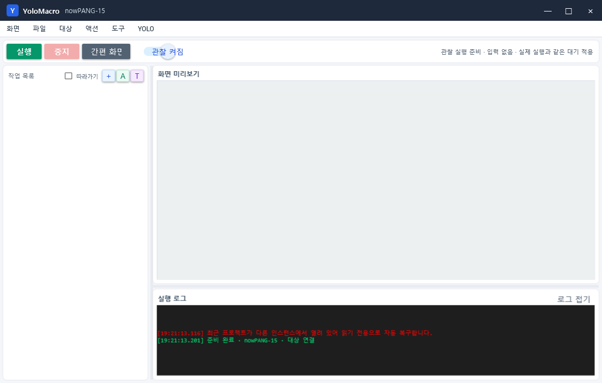

# 작업 목록 현재 위치 표시 안내 (v1.2.2)

긴 작업 목록이 빠르게 실행될 때 화면이 위아래로 계속 이동하는 문제를 수정했습니다.



## 기본 동작

- 현재 검사 중인 항목의 이름 앞에 `▶`를 표시합니다.
- 사용자가 클릭해 둔 항목은 그대로 선택된 상태를 유지합니다.
- 스크롤 위치도 그대로 유지하므로 긴 목록이 위아래로 튀지 않습니다.
- 상단 실행 상태에는 현재 항목 이름과 판정 이유가 계속 표시됩니다.

```text
사용자가 보고 있는 위치                 실제 검사 위치
선택과 스크롤 유지                      ▶ 현재 검사 중인 작업
          └──────── 목록을 강제로 이동하지 않음 ────────┘
```

## 현재 항목을 자동으로 따라가고 싶을 때

작업 목록 위의 `따라가기`를 켜면 이전 방식처럼 현재 실행 항목을 선택하고 보이는 위치로 자동 스크롤합니다. 목록 이동이 불편한 사용자가 더 많으므로 기본값은 꺼짐입니다.

| 설정 | 현재 항목 표시 | 사용자 선택 유지 | 자동 스크롤 |
|---|---:|---:|---:|
| 따라가기 꺼짐, 기본 | `▶` 표시 | 유지 | 안 함 |
| 따라가기 켜짐 | `▶` 표시 | 현재 항목으로 이동 | 실행 항목을 따라감 |

## 관찰 실행 속도

v1.2.1에서 수정한 동작도 그대로 유지됩니다. 관찰 실행은 마우스·키보드·웹훅·AI 전송·메모리 조작을 차단하지만 액션 전·후 딜레이는 실제 실행과 동일하게 적용합니다.

## 검증 항목

- 따라가기 꺼짐 상태에서 다른 항목을 검사해도 기존 선택이 바뀌지 않음
- 실행 항목에는 `▶` 표시가 생성됨
- Release 빌드 경고 0, 오류 0
- 관찰 실행 캡처 수행, 실제 입력 호출 0회, 액션 후 대기 보존
- GitHub 기본 코드 브랜치와 v1.2.2 Release 버전 일치
