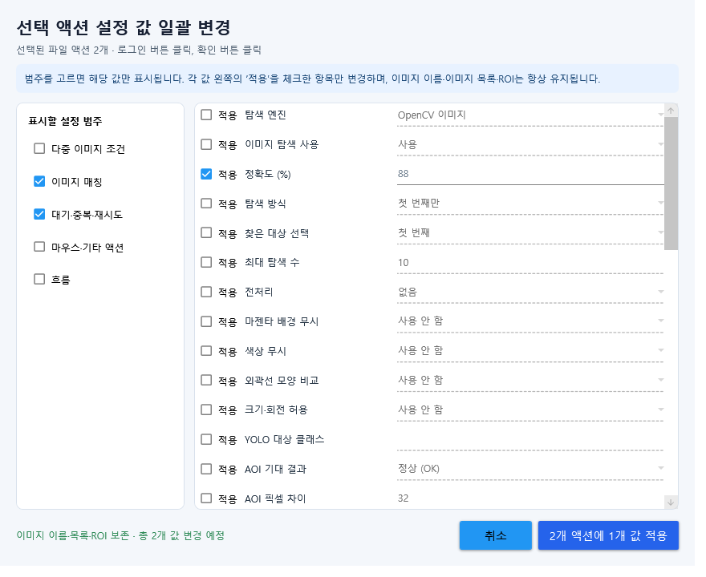

# v1.3.1 검증 기록

검증일: 2026-07-15

## 자동 검증

| 검증 | 결과 |
|---|---|
| Release 전체 빌드 | 경고 0, 오류 0 |
| WorkflowRegressionSmoke | 전체 통과 |
| MatchSmoke | 정확·색상 변경·호버·호환·엄격 검증 통과 |
| CaptureSmoke | 960×552 캡처 성공, 19ms |
| ActionSettingsUiSmoke | 기존 설정창·메인창·복사창·새 일괄 변경창 통과 |
| Markdown 이미지 링크 | 누락 0개 |

## 캡처 1회 회귀 조건

가짜 대상창의 첫 캡처에는 서로 다른 세 템플릿을 세 ROI에 배치하고, 두 번째 이후 캡처는 빈 흰 화면을 반환하도록 구성했습니다.

- `CaptureMode=OncePerLoop`
- `RestartCycleAfterAction=true/false` 각각 검증
- 이미지 액션 3개
- ROI 3개
- 실제 입력은 가짜 런타임 어댑터가 횟수만 기록

안전 재시작을 켠 결과는 캡처 1회, 입력 1회이며 첫 입력 뒤 오래된 프레임의 나머지 액션은 실행하지 않습니다. 설정을 끈 결과는 캡처 1회, 입력 3회로 전체 목록 공유 동작을 유지합니다. 입력 뒤 전방 점프는 점프 대상을 유지하면서 새 화면을 캡처해 `캡처 2회, 입력 1회`인지 별도로 확인합니다. 스마트 대기 미발견 항목도 캡처 횟수 1회를 검증합니다.

## 29 ROI 성능 스모크

1280×720 프레임에 29개 ROI와 29개 템플릿을 만들고 20회 반복했습니다. 동일 환경에서 세 번 반복한 결과입니다.

| 경로 | 시간 |
|---|---:|
| ROI Bitmap 복제 + 화면/템플릿 반복 Mat 변환 | 647~679ms |
| 공유 프레임 Mat + ROI 뷰 + 템플릿 Mat 캐시 | 481~619ms |
| 측정 속도 향상 | 1.05~1.41배 |

이 수치는 OpenCV 매칭 경로만 비교한 마이크로 벤치마크입니다. 실제 실행에서는 상태 변화 기반 미리보기 제한과 Replay ROI·60초 제한으로 UI 복제, JPEG 인코딩, 디스크 쓰기 부하도 추가로 감소합니다. 대상 게임의 지속 애니메이션, ROI 크기와 템플릿 전처리에 따라 실제 CPU 감소폭은 달라집니다.

## 새 일괄 변경 검증

- 서로 다른 정확도 값을 `여러 값`으로 감지
- 체크한 정확도만 두 액션에 적용
- 체크하지 않은 동작 후 대기 유지
- 이미지 이름, 다중 이미지 목록, ROI 유지
- 범위를 벗어난 값은 모든 대상을 변경하기 전에 차단
- 선택 범주에 따라 필드가 노출되는 880×720 UI 렌더링 확인

