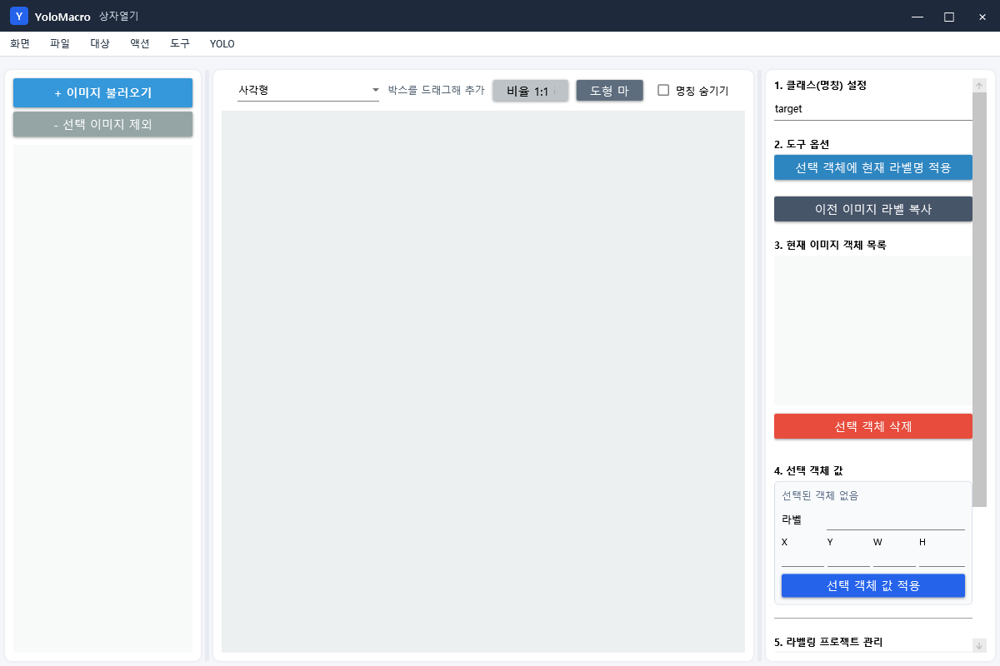
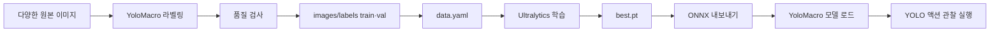
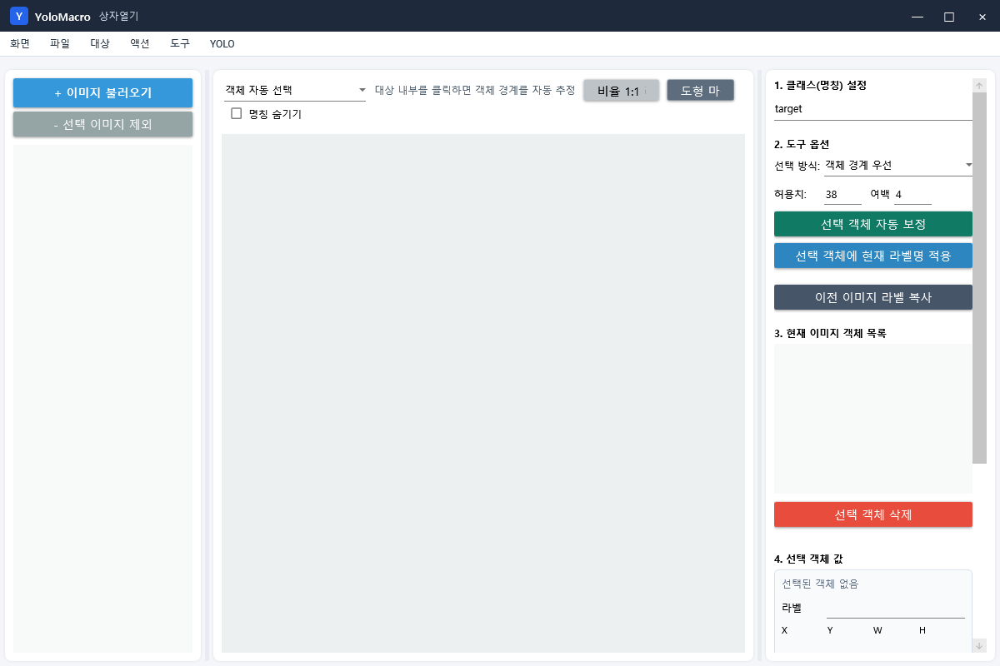

# YOLO 라벨링·학습·YoloMacro 연결 A-Z

이 문서는 원본 이미지 준비부터 YoloMacro 라벨링, YOLO 데이터셋 내보내기, Ultralytics 학습, ONNX 변환, YoloMacro 액션 연결까지 한 번에 완료하는 절차입니다.



## 결과물 흐름



## A. 무엇을 탐지할지 먼저 정의하기

라벨링 전에 클래스 정책을 정합니다.

좋은 클래스 이름:

- `reward_button`
- `play_button`
- `enemy`
- `warning_icon`

피해야 할 이름:

- 의미가 겹치는 `button`, `btn`, `playBtn` 혼용
- 이미지마다 다른 철자와 대소문자
- 너무 세분화돼 샘플이 거의 없는 클래스

같은 시각적 객체가 같은 자동화 동작을 유발한다면 같은 클래스로 묶는 편이 좋습니다. 서로 다른 동작이 필요하면 클래스를 분리합니다.

## B. 원본 이미지 수집

학습 이미지는 실제 운영 환경을 대표해야 합니다.

포함할 변화:

- 객체의 위치와 크기
- 배경과 주변 UI
- 밝기, 색상, 눌림·호버 상태
- 일부 가림과 겹침
- 창 크기와 DPI
- 객체가 없는 화면

학습과 검증에 거의 같은 연속 프레임만 넣으면 실제 성능보다 좋아 보이는 데이터 누수가 생깁니다. 장면, 시간, 계정 또는 스테이지 단위로 다양하게 수집하세요.

권장 시작량은 문제 난이도에 따라 크게 다르지만, 한 클래스당 소수 이미지만으로 끝내지 말고 실제 실패 장면을 계속 추가하는 방식이 안전합니다.

## C. 이미지 불러오기

1. `라벨링` 탭을 엽니다.
2. `+ 이미지 불러오기`를 누릅니다.
3. 여러 이미지 파일을 선택합니다.
4. 왼쪽 목록에서 첫 이미지를 선택합니다.
5. 가운데 캔버스에 원본 해상도로 표시되는지 확인합니다.

이미지 목록에서 제외하는 것은 원본 파일 삭제와 다릅니다. 작업 대상에서만 빼려면 `- 선택 이미지 제외`를 사용합니다.

## D. 클래스명 설정

오른쪽 `1. 클래스(명칭) 설정`에 현재 객체의 클래스명을 입력합니다. 이후 그리는 객체에 이 이름이 적용됩니다.

규칙:

- 앞뒤 공백을 넣지 않습니다.
- 같은 클래스는 항상 같은 철자를 사용합니다.
- 학습 후 YoloMacro의 `YOLO 대상 클래스`에도 정확히 같은 이름을 입력합니다.
- 클래스 ID는 내보낼 때 클래스명을 사전순으로 정렬해 자동 지정됩니다. 직접 ID를 기억하기보다 `data.yaml`의 `names`를 기준으로 관리합니다.

## E. 라벨링 도구 선택

YoloMacro는 여러 도형 도구를 제공하지만 현재 YOLO 내보내기는 모든 도형의 경계 사각형을 YOLO detection 박스로 변환합니다.

| 도구 | 만드는 방법 | Detection 내보내기 결과 |
|---|---|---|
| 사각형 | 객체 바깥을 드래그 | 그 사각형 |
| 다각형 | 꼭짓점을 순서대로 클릭 후 마감 | 다각형을 감싼 박스 |
| 점/키포인트 | 위치 클릭 | 점들을 감싼 박스, 단일 점은 유효 크기 확인 필요 |
| 3D 박스 | 영역 지정 | 전체 경계 박스 |
| 직선/곡선 | 점을 찍고 도형 마감 | 선을 감싼 박스 |
| 격자 | 영역 드래그, 행/열 지정 | 전체 격자 경계 박스 |
| 원/타원 | 영역 드래그 | 타원을 감싼 박스 |
| 색상 영역 자동 선택 | 비슷한 색 영역 선택 | 선택 영역 경계 박스 |
| 객체 자동 선택 | 클릭/영역 기반 자동 분리 | 선택된 객체 경계 박스 |

일반적인 YOLO 객체 탐지는 `사각형` 또는 `객체 자동 선택`을 권장합니다.

## F. 정확한 박스 그리기

1. `사각형`을 선택합니다.
2. 클래스명을 확인합니다.
3. 객체의 보이는 외곽에 맞춰 드래그합니다.
4. 오른쪽 현재 객체 목록에서 방금 만든 객체를 선택합니다.
5. 필요하면 X, Y, W, H를 숫자로 보정하고 `선택 객체 값 적용`을 누릅니다.

좋은 박스:

- 객체 전체를 포함
- 불필요한 배경 여백이 적음
- 잘린 객체는 보이는 부분에 일관된 정책 적용
- 같은 객체 유형에서 박스 기준이 일정

나쁜 박스:

- 객체 절반만 포함
- 주변 객체까지 한 박스에 포함
- 이미지마다 넓은 여백과 타이트한 박스가 혼재
- 클래스가 잘못 지정됨

## G. 자동 선택과 보정



`객체 자동 선택`은 클릭한 객체의 색·경계 특성을 이용해 영역을 찾고 박스를 만듭니다.

- 선택 방식: 객체 특성에 맞는 모드를 선택
- 허용치: 비슷한 색이나 픽셀을 얼마나 포함할지 조절
- 여백: 자동 경계 밖으로 추가할 픽셀
- `선택 객체 자동 보정`: 만들어진 박스를 다시 객체 경계에 맞춤

자동 결과는 반드시 눈으로 확인합니다. 배경과 객체 색이 비슷하면 수동 박스가 더 정확합니다.

## H. 연속 이미지 빠르게 처리

같은 대상이 비슷한 위치에 반복되면 `이전 이미지 라벨 복사`를 사용합니다.

1. 첫 이미지의 라벨을 정확하게 만듭니다.
2. 다음 이미지로 이동합니다.
3. 이전 라벨을 복사합니다.
4. 실제 위치와 크기에 맞게 각 박스를 수정합니다.

복사 후 확인 없이 넘기면 데이터 품질이 빠르게 나빠집니다.

## I. 객체 선택·수정·삭제

- 캔버스 객체 또는 현재 이미지 객체 목록을 선택합니다.
- 여러 객체를 선택해 현재 클래스명을 함께 적용할 수 있습니다.
- 단일 객체는 클래스, X, Y, W, H를 직접 수정할 수 있습니다.
- 잘못된 객체는 `선택 객체 삭제`로 제거합니다.
- 마우스 휠로 확대/축소하고 오른쪽 드래그로 화면을 이동할 수 있습니다.
- `비율 1:1 리셋`으로 원래 배율로 돌아갑니다.

## J. 객체가 없는 이미지

객체가 실제로 없는 이미지는 왼쪽의 `빈 이미지`로 확정합니다. 이 상태는 단순 미라벨 이미지와 구분되며, 내보낼 때 빈 TXT 라벨 파일과 함께 negative 학습 이미지로 포함됩니다. 배경만 있는 화면을 negative로 포함하면 배경 무늬를 객체로 오검출하는 문제를 줄일 수 있습니다.

객체가 있는 이미지는 라벨을 모두 확인한 뒤 `검수 완료`를 누릅니다. 라벨을 수정하면 상태가 다시 `작업중/재검수 필요`로 돌아갑니다.

## K. 작업 상태 저장과 복원

1. 일정 작업마다 `작업 상태 저장`을 누릅니다.
2. 라벨 프로젝트 JSON을 안전한 위치에 저장합니다.
3. 다시 시작할 때 `이전 작업 불러오기`를 사용합니다.

작업 JSON은 이미지 경로와 객체 좌표를 저장합니다. 원본 이미지를 이동하거나 삭제하면 경로가 끊길 수 있으므로 이미지 폴더 구조도 함께 보관합니다.

## L. 데이터 품질 검사

`데이터 품질 검사`는 다음 문제를 찾는 데 사용합니다.

- 원본 이미지 누락
- 이미지 범위를 벗어난 박스
- 너무 작은 박스
- 클래스 불균형
- 중복 이미지
- train/val에 동일하거나 거의 같은 이미지가 섞일 위험
- 검수 미완료 또는 확정되지 않은 무라벨 이미지
- `빈 이미지` 상태에 남아 있는 객체 라벨

보고서는 프로젝트의 `DatasetReports` 폴더에 저장됩니다. 오류를 수정한 뒤 다시 실행하세요.

## M. YOLO 학습셋 내보내기

1. `YOLO 학습셋 내보내기`를 누릅니다.
2. 빈 출력 폴더를 선택합니다.
3. 완료 메시지에서 전체/학습/검증 이미지, 객체, 클래스 수를 확인합니다.

YoloMacro는 라벨이 있거나 `빈 이미지`로 확정된 이미지를 고정 시드로 섞고 기본 20%를 검증 세트로 분리합니다. 파일 내용이 동일한 이미지들은 하나의 그룹으로 묶어 모두 train 또는 모두 val에 배치하므로 파일명만 다른 중복 이미지의 직접 누수를 방지합니다.

출력 구조:

```text
export-folder/
├─ data.yaml
├─ images/
│  ├─ train/
│  └─ val/
└─ labels/
   ├─ train/
   └─ val/
```

YOLO TXT 한 줄 형식:

```text
class_id center_x center_y width height
```

좌표는 이미지 폭과 높이에 대해 0~1로 정규화되며 소수점 여섯 자리로 기록됩니다.

`빈 이미지`는 이미지와 내용이 비어 있는 동일 이름의 TXT 파일로 내보냅니다. 일반 객체 이미지는 기존 프로젝트와의 호환을 위해 검수 상태와 관계없이 내보내지만, 품질 검사에서 미검수 경고를 냅니다.

생성되는 `data.yaml` 예시:

```yaml
train: ./images/train
val: ./images/val
nc: 2
names: ['play_button', 'reward_button']
```

## N. 내보낸 데이터 수동 점검

학습 전에 반드시 확인합니다.

1. `images/train/a.png`와 `labels/train/a.txt`처럼 이미지와 TXT 이름이 대응하는지 확인합니다.
2. `data.yaml`의 클래스 순서와 라벨 의도가 맞는지 확인합니다.
3. train과 val에 거의 같은 프레임이 섞이지 않았는지 확인합니다.
4. 클래스별 이미지와 객체 수를 확인합니다.
5. 몇 장을 별도 YOLO 시각화 도구로 열어 박스가 정확한지 확인합니다.

## O. Python과 Ultralytics 설치

학습은 YoloMacro 내부가 아니라 Python/Ultralytics 환경에서 수행합니다. 최신 설치법은 [Ultralytics 공식 설치 문서](https://docs.ultralytics.com/quickstart/)를 기준으로 합니다.

PowerShell 예시:

```powershell
python -m venv .venv
.\.venv\Scripts\Activate.ps1
python -m pip install --upgrade pip
pip install -U ultralytics
```

NVIDIA GPU를 사용한다면 설치된 드라이버와 CUDA에 맞는 PyTorch 구성이 필요합니다. GPU 환경은 [PyTorch 공식 설치 선택기](https://pytorch.org/get-started/locally/)에서 명령을 확인하세요.

설치 확인:

```powershell
yolo checks
```

## P. 사전 학습 모델 선택

처음에는 작은 detection 사전 학습 모델에서 전이 학습하는 것이 일반적입니다. 설치된 Ultralytics 버전이 제공하는 모델명을 사용하세요. 최신 문서 예시는 `yolo26n.pt`를 사용하지만 기존 버전에서는 다른 세대 이름을 사용할 수 있습니다.

모델 이름을 문서에서 그대로 추측하지 말고 현재 설치 버전의 [Ultralytics Detection 문서](https://docs.ultralytics.com/tasks/detect/)와 CLI 도움말을 확인합니다.

## Q. 학습 실행

[Ultralytics 공식 Train 문서](https://docs.ultralytics.com/modes/train/)의 CLI 문법은 `arg=value` 형식입니다. `--arg` 방식이나 쉼표를 사용하지 않습니다.

데이터셋 폴더에서 실행하는 예시:

```powershell
yolo detect train model=yolo26n.pt data="C:\datasets\my-project\data.yaml" epochs=100 imgsz=640 batch=16 project="C:\datasets\runs" name=my_detector
```

주요 인자:

| 인자 | 의미 | 조정 기준 |
|---|---|---|
| model | 시작 가중치 | 작은 모델로 먼저 검증 |
| data | YoloMacro가 만든 data.yaml | 절대 경로 권장 |
| epochs | 전체 학습 반복 수 | 검증 지표와 과적합 확인 |
| imgsz | 입력 크기 | 작은 객체는 큰 크기가 유리하나 느림 |
| batch | 한 번에 처리할 이미지 수 | GPU 메모리에 맞춤 |
| device | `0`, `cpu` 등 | 자동 선택 또는 명시 |
| project/name | 결과 저장 위치 | 실험별 이름 분리 |

CPU 예시:

```powershell
yolo detect train model=yolo26n.pt data="C:\datasets\my-project\data.yaml" epochs=50 imgsz=640 device=cpu
```

## R. 학습 결과 확인

학습 결과 폴더에는 일반적으로 다음이 생성됩니다.

- `weights/best.pt`: 검증 성능이 가장 좋았던 모델
- `weights/last.pt`: 마지막 epoch 모델
- 결과 그래프와 confusion matrix
- 예측 샘플 이미지

확인할 항목:

- train 손실만 줄고 val 성능이 나빠지지 않는가?
- 특정 클래스만 성능이 낮지 않은가?
- 오탐 이미지에 공통 배경이 있는가?
- 작은 객체가 누락되지 않는가?

검증 명령 예시:

```powershell
yolo detect val model="C:\datasets\runs\my_detector\weights\best.pt" data="C:\datasets\my-project\data.yaml"
```

실제 미사용 이미지 예측:

```powershell
yolo detect predict model="C:\datasets\runs\my_detector\weights\best.pt" source="C:\datasets\test-images" conf=0.25 save=True
```

## S. 실패 데이터를 다시 라벨링

첫 모델이 실패한 화면을 모아 데이터에 추가합니다.

- 놓친 객체: 정확한 박스 추가
- 잘못 잡은 배경: 비슷한 배경을 더 다양하게 수집
- 혼동 클래스: 클래스별 구분 특징이 보이는 샘플 추가
- 임계값 근처 화면: YoloMacro 능동 학습 검토함 활용

기존 train/val에 이미 있는 이미지의 복사본을 새 이름으로 반복 추가하지 마세요.

## T. ONNX로 내보내기

YoloMacro는 ONNX Runtime으로 모델을 읽습니다. [Ultralytics 공식 ONNX 문서](https://docs.ultralytics.com/integrations/onnx/)에 따라 `best.pt`를 ONNX로 변환합니다.

고정 640 입력 예시:

```powershell
yolo export model="C:\datasets\runs\my_detector\weights\best.pt" format=onnx imgsz=640 simplify=True
```

Python 예시:

```python
from ultralytics import YOLO

model = YOLO(r"C:\datasets\runs\my_detector\weights\best.pt")
model.export(format="onnx", imgsz=640, simplify=True)
```

YoloMacro는 ONNX 입력 메타데이터에서 폭과 높이를 읽고, 동적이거나 알 수 없는 크기면 640을 사용합니다. 처음에는 고정 입력 크기 ONNX를 권장합니다.

Ultralytics가 ONNX에 `names` 메타데이터를 포함하면 YoloMacro가 클래스 이름을 자동으로 읽습니다. 메타데이터가 없으면 COCO 기본 이름으로 대체되므로 사용자 클래스 모델에서는 클래스 이름이 잘못 보일 수 있습니다.

## U. YoloMacro에 ONNX 불러오기

1. YoloMacro를 실행합니다.
2. 상단 `YOLO` 메뉴를 엽니다.
3. 모델 경로에 생성된 `.onnx`를 지정합니다.
4. `모델 로드`를 누릅니다.
5. 실행 로그에서 모델 로드 성공을 확인합니다.
6. `모델 정보 등록`으로 SHA-256, 입력 크기와 클래스 목록을 프로젝트 모델 레지스트리에 기록합니다.

모델 로드에 실패하면 ONNX 파일 경로, 입력/출력 형상, 지원 opset과 ONNX Runtime 호환성을 확인합니다.

## V. YOLO 액션 만들기

1. RPA 실행 탭에서 액션을 추가합니다.
2. 액션 설정에서 비전 엔진을 YOLO로 선택합니다.
3. `YOLO 대상 클래스`에 `data.yaml`의 클래스명을 정확히 입력합니다.
4. 임계값을 설정합니다.
5. 필요한 경우 ROI를 지정해 탐지 범위를 줄입니다.
6. 첫 번째/전체/랜덤 대상 선택 방식을 정합니다.
7. 클릭은 찾은 박스 중심 상대 좌표를 권장합니다.
8. 발견/미발견 분기를 설정합니다.

YOLO를 사용하는 체크된 액션이 있는데 모델을 로드하지 않으면 실행이 시작되지 않습니다.

## W. 관찰 실행 검증

1. `관찰 실행`을 켭니다.
2. 실행합니다.
3. 미리보기에서 녹색 YOLO 박스와 클래스명을 확인합니다.
4. 로그의 신뢰도와 발견 결과를 확인합니다.
5. 다른 배경, 위치, 크기에서도 반복 시험합니다.
6. 오탐과 미탐 화면을 별도 폴더에 모읍니다.

관찰 실행은 실제 입력을 보내지 않으므로 모델 검증에 적합합니다.

## X. 임계값 조정

액션 설정의 YOLO 패널에서 `NMS IoU %`와 `최대 검출 수`를 조정할 수 있습니다. NMS는 서로 겹친 같은 클래스 박스를 하나로 정리합니다. 일반적으로 40~60%에서 시작하고, 붙어 있는 실제 객체가 하나로 사라지면 값을 높이며 중복 박스가 남으면 값을 낮춥니다.

- 오탐이 많음: 임계값을 높임, 배경 실패 샘플 추가, ROI 축소
- 미탐이 많음: 임계값을 낮춰 분포 확인, 누락 장면 재학습
- 클래스 혼동: 라벨 정책과 클래스별 데이터 균형 수정
- 작은 객체 누락: 고해상도 원본, 더 큰 imgsz, 더 정확한 박스 고려

임계값만 극단적으로 조정해 데이터 문제를 숨기지 마세요.

## Y. 모델과 데이터 보관

다음을 한 세트로 보관합니다.

```text
model-release/
├─ dataset-version.txt
├─ data.yaml
├─ best.pt
├─ best.onnx
├─ training-command.txt
├─ metrics/
└─ test-images/
```

ONNX 파일이 바뀌면 YoloMacro의 모델 정보 등록을 다시 수행해 해시와 클래스 정보를 갱신합니다.

## Z. 최종 체크리스트

- [ ] 클래스 이름 정책이 일관된다.
- [ ] 운영 환경의 위치·크기·배경 변화를 포함했다.
- [ ] 모든 박스를 눈으로 검토했다.
- [ ] 데이터 품질 검사 오류를 처리했다.
- [ ] train/val 유사 이미지 누수를 확인했다.
- [ ] `data.yaml` 클래스 순서가 맞다.
- [ ] 별도 테스트 이미지에서 `best.pt`를 검증했다.
- [ ] ONNX로 정상 변환했다.
- [ ] YoloMacro가 클래스 메타데이터를 읽었다.
- [ ] 관찰 실행에서 박스와 신뢰도를 확인했다.
- [ ] 실제 실행 전 반복 클릭 방지와 ROI를 설정했다.

## 자주 발생하는 오류

| 오류 | 원인 | 해결 |
|---|---|---|
| 라벨이 지정된 이미지가 없습니다 | 객체가 하나도 없거나 이미지 경로 누락 | 박스 추가, 원본 경로 복구 |
| 유효한 클래스명이 없습니다 | 클래스명이 비어 있음 | 객체 클래스 입력 후 적용 |
| 학습에서 data.yaml 경로 오류 | 현재 폴더 또는 따옴표 문제 | 절대 경로와 따옴표 사용 |
| CUDA out of memory | batch/imgsz가 큼 | batch 또는 imgsz 감소 |
| ONNX 로드는 되지만 클래스가 틀림 | names 메타데이터 누락 | Ultralytics export 사용, 모델 정보 확인 |
| YoloMacro 실행 전 모델 경고 | YOLO 액션이 있지만 모델 미로드 | 상단 YOLO 메뉴에서 모델 로드 |
| 객체 박스가 어긋남 | 창 크기/ROI 또는 학습 데이터 차이 | 실행 환경 고정, ROI 재설정, 재학습 |
