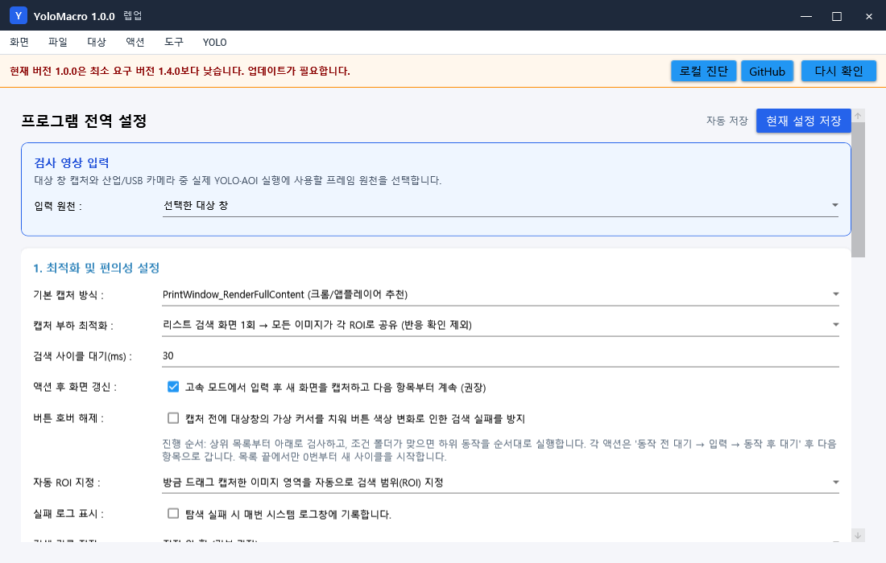
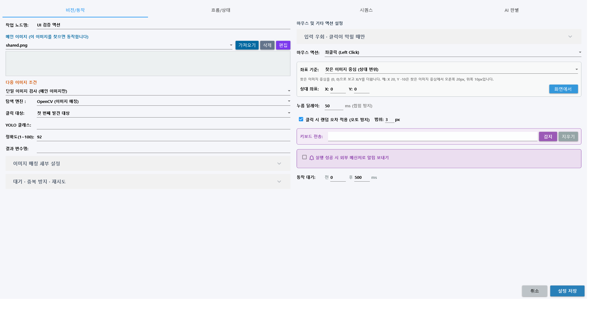
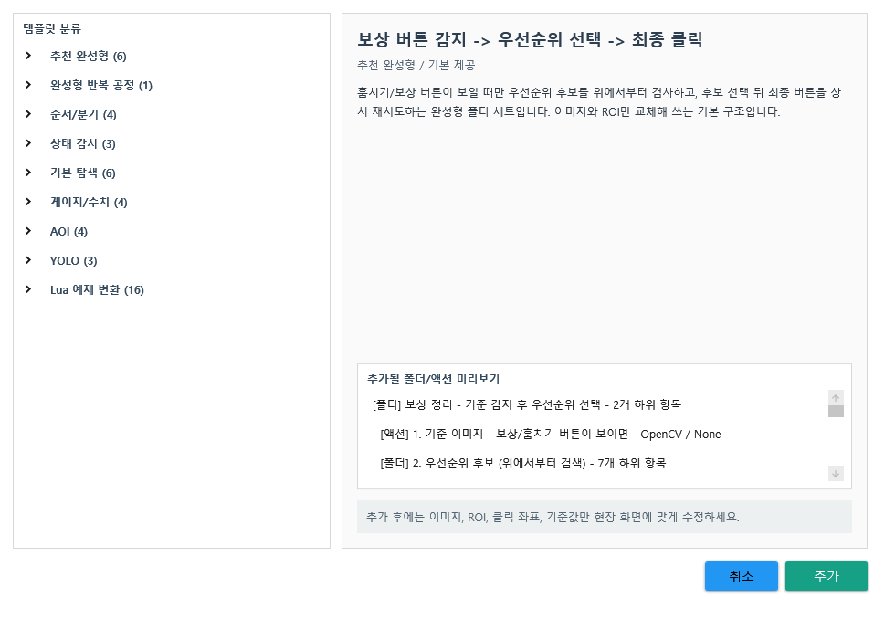

# YoloMacro 전체 기능 참고서

이 문서는 메뉴와 기능을 빠르게 찾기 위한 참고서입니다. 처음부터 따라 하는 설명은 [전체 사용자 설명서](USER_MANUAL.md)를 먼저 읽으세요.

## 상단 메뉴

### 화면

RPA 실행, AOI, 라벨링, 설정 탭으로 이동합니다.

### 파일

| 기능 | 설명 |
|---|---|
| 새 프로젝트 | 격리된 새 프로젝트 작업 공간 생성 |
| 열기 | 프로젝트 JSON 열기와 대상 복원 |
| 저장 | 현재 프로젝트 저장 |
| 다른 이름으로 저장 | 이미지 참조를 포함한 별도 프로젝트 사본 생성 |
| ImageMax 가져오기 | 지원되는 ImageMax 설정을 YoloMacro 작업으로 변환 |

### 대상

| 기능 | 설명 |
|---|---|
| 타겟 설정 | 현재 열린 창에서 자동화 대상 선택 |
| 타겟 상세 조건 | 제목, 프로세스, 클래스, 자식 창 조건 지정 |
| 대상 진단 | 부모/입력 HWND, 크기, 좌표 오프셋 기록 |
| 다음/주 모니터 이동 | 대상 창 모니터 변경 |
| 마지막 모니터 보관 | 화면을 방해하지 않는 위치에 안정 보관 |
| 투명 보관 | 실험적인 투명 상태 보관 |
| 원래 위치 복원 | 저장된 창 위치와 표시 상태 복구 |

### 액션

- 폴더 추가
- 액션 추가
- 템플릿 추가
- 현재 작업을 사용자 템플릿으로 저장
- 선택 항목에 설정 그룹 복사
- 선택 삭제

### 도구

| 기능 | 설명 |
|---|---|
| 프로젝트 안전 검사 | 누락 이미지, ROI, 참조, 순환, 위험 권한 검사 |
| 프로젝트 이미지 복구·정리 | 누락 파일 복구, 중복과 참조 정리 |
| 실행 재생 기록 | 상태 변화와 실패 프레임 확인 |
| 능동 학습 검토함 | 임계값 근처 화면 검토 |
| 시각적 노드 에디터 | 작업 흐름을 그래프 형태로 편집 |
| 미사용 이미지 정리 | 프로젝트에서 참조하지 않는 이미지 정리 |
| 프로그램 창 위치 초기화 | 창을 주 모니터 중앙의 기본 크기로 복구 |
| 리스트 배치 | 실행 목록을 왼쪽 또는 위쪽에 배치 |

### YOLO

- ONNX 모델 경로 지정
- 모델 로드
- 모델 정보 등록: 해시, 입력 크기, 클래스 목록 보관

## RPA 실행 탭

### 상단 실행 도구

| 기능 | 설명 |
|---|---|
| 실행/F5 | 체크된 작업 실행 |
| 중지/F6 | 현재 실행 취소 |
| 간편 화면 | 미리보기와 로그 중심 표시 |
| 관찰 실행 | 입력 없이 판정·분기·딜레이 확인 |
| 상태 문구 | 현재 항목과 판정 이유 표시 |

### 작업 목록

- 폴더 계층과 체크 상태
- 빠른 추가 `+`, `A`, `T`, 기준 설정 그룹 `복사`, 선택 필드 일괄 `변경`
- `▶` 현재 검사 마커
- 선택적 `따라가기`
- 드래그 순서 변경과 다중 선택
- 우클릭 테스트/캡처/ROI/설정
- 우클릭 기준 액션에서 다중 이미지 조건, 매칭, 대기·재시도, 입력, 흐름을 선택 복사

### 미리보기와 로그

- 현재 대상 프레임
- ROI 점선
- OpenCV/YOLO/AOI/OCR/대표 이미지 사전 탐지 박스
- 발견 점수, 입력 경로, 분기, 딜레이와 오류 로그
- 로그 접기/펼치기와 패널 크기 저장

## 액션 설정

### 기본/동작 탭

- OpenCV, YOLO, AOI, OCR, 대표 이미지 사전, Gauge, Frame Stability 엔진
- OCR 한국어·영문·숫자 프로필, 포함/일치/정규식/숫자 임계값, ROI 즉시 테스트
- 대표 이미지 사전 라벨 샘플 캡처, 특정/전체 라벨 판정, 색상/회색/윤곽·다중 크기 비교
- 여러 기준 이미지의 Single/OR/AND 조건
- 유사도와 찾기 개수
- 정확/색상 무시/외곽선/크기 회전/이진화 프리셋
- ROI와 화면 테스트
- 스마트 대기, 지속 인식, 미발견 실행
- 액션 간격, 사라짐 재무장, 클릭 반응 확인
- 마우스, 키보드, 드래그, 휠, 랜덤 좌표
- 비활성 입력, 실제 커서, Interception, DLL 인젝션
- 웹훅 메시지
- 동작 전·후 딜레이

### 흐름/상태 탭

- 발견/미발견별 Continue, Retry, Jump, Stop
- 다른 항목 런타임 Enable/Disable
- 우선순위 비전 그룹

### 시퀀스 탭

- Key Down, Up, Press
- Delay
- 입력 레코딩
- 여러 액션을 한 항목에서 순차 실행

### AI 판별 탭

- Gemini 판별 사용
- ROI 또는 전체 대상창 캡처
- 질문과 기대 답변
- Yes/No별 Continue, Retry, Jump, Stop

## 폴더와 템플릿

폴더는 작업을 묶거나 이미지 조건 게이트로 사용합니다. 추천 완성형 템플릿에는 폴더 조건, 상태 전환, 보상 우선순위, 로딩 복구와 팝업 처리 같은 반복 패턴이 포함됩니다.

사용자 작업을 템플릿으로 저장하면 프로젝트 간 재사용할 수 있습니다. 템플릿을 추가할 때 내부 항목 ID와 점프 참조는 새 프로젝트에 맞게 다시 생성됩니다.

## AOI 탭

- 프레임 캡처
- 검사 ROI와 정렬 ROI
- 현재 ROI를 OK/NG 샘플로 저장
- 기존 OK/NG 파일 가져오기
- 픽셀 차이, NG %, 최소 결함 면적
- 위치 자동 정렬
- 밝기 정규화, 히스토그램, 노이즈 완화, 선명화, Otsu
- 대비, 밝기, 블러
- OK/NG 기준 자동 계산
- 단발 검사와 결함 위치 표
- 프로젝트별 학습 폴더

자세한 내용은 [AOI 가이드](AOI_GUIDE.md)를 참고하세요.

## 라벨링 탭

- 여러 이미지 불러오기/제외
- 사각형, 다각형, 점, 키포인트, 3D 박스
- 직선, 격자, 타원, 곡선
- 색상 영역 자동 선택, 객체 자동 선택
- 선택 객체 자동 보정
- 이전 이미지 라벨 복사
- 다중 객체 클래스 변경
- X/Y/W/H 직접 편집
- 작업 상태 저장/복원
- 데이터 품질 검사
- YOLO detection 데이터셋 내보내기

자세한 내용은 [YOLO 라벨링·학습·연결 A-Z](YOLO_LABELING_TRAINING_GUIDE.md)를 참고하세요.

## 설정 탭

### 최적화와 캡처

- 기본 캡처 방식
- 항목별 캡처 또는 리스트 시작 전체창 한 번 캡처 후 모든 ROI 공유
- 검색 사이클 대기
- 액션 후 화면 갱신: 입력 뒤 새 화면을 캡처하고 다음 항목 계속
- 캡처 전 호버 해제
- 자동 ROI 지정 방식

### 실행

- 무한 반복/1회 실행
- 기본 재시도 대기
- 활성창 실제 커서 모드
- 전역 F5/F6 단축키

### 기록과 학습

- 실패 로그 표시
- 비전 검색 기록 모드: 끔, 성공, 상태 변화, 전체
- 로그 파일 크기, 보존 일수와 총용량
- 실행 Replay 저장 수준, 전체 용량, 보관 일수, 즉시 비우기
- 능동 학습과 임계값 여백

### 실행 안전 제한

- 최대 연속 실행 시간
- 사이클당 같은 노드 최대 방문
- 분당 최대 액션

### 화면 배치

- 실행 목록 위치와 크기
- 미리보기와 로그 크기
- AOI 설정/결함 패널 크기
- 라벨링 이미지 목록/옵션 패널 크기
- 마지막 탭과 간편 화면 상태

### 외부 기능

- Gemini API 키와 모델
- 메모리 모니터 사용과 프로필 경로
- 업데이트 채널과 매니페스트 URL
- GitHub 업데이트 확인

## 입력 방식 선택표

| 입력 방식 | 장점 | 주의 |
|---|---|---|
| 비활성 PostMessage | 커서를 빼앗지 않음 | 일부 게임/앱이 무시 |
| 활성창 실제 커서 | 높은 호환성 | 실행 중 실제 커서가 움직임 |
| 강제 실제 커서 | 액션별 선택 가능 | 대상 창 활성화 필요 |
| Interception | 드라이버 수준 입력 | 드라이버 설치와 권한 필요 |
| OpenGL DLL 인젝션 | 특수 렌더링 대응 | 고위험 고급 기능, 안전 검사 필수 |

## 이미지 판정 선택표

| 판정 | 학습 필요 | 위치 변화 | 작은 결함 | 속도 |
|---|---:|---:|---:|---:|
| OpenCV | 아니오 | 제한적 | 제한적 | 빠름 |
| YOLO | 예 | 강함 | 데이터에 따라 | 중간 |
| AOI | OK/NG 샘플 | 작은 정렬 보정 | 강함 | 중간 |
| OCR | 언어 데이터 | 글꼴·배율 설정에 따라 | 텍스트 대비에 따라 | 중간 |
| 대표 이미지 사전 | 라벨별 ROI 샘플 | 다중 크기 허용 | 샘플 다양성에 따라 | 중간 |
| Gauge | 아니오 | ROI 고정 | 비율 전용 | 빠름 |
| AI | 프롬프트 | 강함 | 의미 판정 | 네트워크 의존 |

## 저장 폴더

프로젝트별로 일반적으로 다음 자료가 관리됩니다.

- 프로젝트 JSON
- `Images`: 액션 기준 이미지
- `Backups`: 프로젝트와 이미지 백업
- `AutoSave`: 세션 자동 저장
- `Replay`: 실행 재생 프레임
- `ActiveLearning/검토대기`: 경계 사례
- `VisionHistory`: 검색 기록
- `AoiInspection`: AOI 프로필과 OK/NG 샘플
- `OcrData`: OCR 언어·전처리·PSM 프로필과 프로젝트별 추가 언어 데이터
- `VisualDictionaries`: 사전 키/라벨별 대표 ROI 이미지
- `DatasetReports`: 라벨 데이터 품질 보고서
- YOLO 모델 레지스트리

정확한 저장 규칙은 [프로젝트 저장 구조](project-storage.md)를 참고하세요.

## 보안과 배포

- API 키는 Windows DPAPI로 보호
- 웹훅은 HTTPS만 허용
- 업데이트 ZIP SHA-256 검증
- 적용 전 기존 파일 백업과 실패 시 복원
- GitHub Actions 빌드, Secret scan, CodeQL, SBOM
- 프로젝트별 위험 권한 분석

[보안·업데이트 상세 문서](SECURITY_AND_UPDATE.md)
