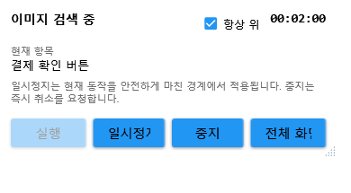
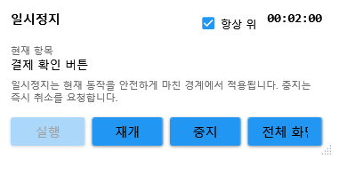

# 색상 불변 이미지 매칭과 Mini 실행 가이드

VisionFlow Studio의 프로그램 버전은 그대로 `2.6.0`이며 OpenCvSharp/OpenCV `5.0.0.20260806`을 사용합니다. 이 문서는 색상 무시 매칭, 안전한 일시정지, Mini 실행창과 프로젝트 백업 정책을 설명합니다.

## 수정한 실제 문제

Compact 액션 설정은 이전에 `색상 무시`라는 프리셋 이름만 저장하고 실행 엔진이 읽는 `IgnoreColor` 등의 세부 플래그를 함께 갱신하지 않았습니다. 화면에는 색상 무시가 선택되어도 실제 실행은 기본 색상 비교가 될 수 있었습니다.

이제 전체 설정, Compact 설정, 선택 값 일괄 변경, 설정 그룹 복사와 ImageMax 가져오기가 하나의 공통 프리셋 정책을 사용합니다.

```text
설정 UI와 가져오기
       ↓
공통 프리셋 정책
       ↓
프로젝트 JSON의 프리셋 + 실행 플래그
       ↓
MacroEngine
       ↓
ImageFinder (OpenCV 5)
```

예전 프로젝트에 `Exact`와 개별 색상/형태 옵션이 함께 저장되어 있으면 옵션을 지우지 않고 `Custom`으로 보존합니다. 프로젝트 스키마는 11이며 앱 버전과 프로젝트 확장자는 그대로입니다.

## OpenCV 5 색상 불변 구조

단순 회색조는 서로 다른 색이 서로 다른 밝기로 바뀌는 경우 같은 모양을 놓칠 수 있습니다. 새 방식은 B/G/R 각 채널에서 Scharr 윤곽 강도를 계산하고 가장 강한 구조를 합칩니다.

| 프리셋 | 비교 기준 | 권장 상황 |
|---|---|---|
| 기본 색상 | 원본 BGR 픽셀 | 색까지 같아야 하는 고정 UI |
| 정밀 픽셀 | 원본 BGR + 엄격 후보 검증 | 작은 색 변화도 NG인 검사 |
| 색상 무시 | 채널별 윤곽을 합친 구조 | 테마, 호버, 눌림, 색상 교체 |
| 모양만 비교 | 색상 불변 구조의 자동 이진화 | 외곽과 내부 배치가 핵심인 아이콘 |
| 빠른 이진화 | 구조 + Otsu 이진화 | 글자, 숫자, 단색 UI |
| 크기·회전 | ORB + USAC MAGSAC | 배율·회전이 달라지는 대상 |

같은 윤곽의 빨강/초록 상태 아이콘처럼 색 자체가 의미라면 색상 무시를 사용하지 마세요. 기본 색상 또는 대표 이미지 사전의 Color 모드를 선택하고, ROI는 가능한 작게 지정한 뒤 설정창의 테스트로 점수와 위치를 확인하는 것이 좋습니다.

## Mini 실행과 안전한 일시정지

메인 실행 도구에서 `미니 실행`을 누르면 편집 화면을 숨기고 작은 실행 컨트롤러를 엽니다.





- 실행 상태, 현재 항목, 흐름 이유와 경과 시간을 메인 엔진과 공유합니다.
- `항상 위`를 끄거나 켤 수 있고 위치는 사용자 설정에 저장합니다.
- 모니터가 제거되거나 해상도가 바뀌면 저장 위치를 현재 작업 영역 안으로 복구합니다.
- 메인 화면과 Mini 창의 일시정지/재개 및 중지 상태가 함께 바뀝니다.
- 일시정지는 키 누름/해제, 드래그, 클릭 같은 하나의 입력 동작을 중간에서 끊지 않습니다. 현재 동작을 마친 뒤 캡처·평가·액션 경계에서 대기합니다.
- 일시정지 중 중지는 취소 토큰과 대기 신호를 함께 해제해 즉시 종료할 수 있습니다.

## 프로젝트 백업

명시 저장 전 만드는 `Backups` 파일은 밀리초와 순번을 함께 사용하므로 같은 순간의 연속 저장도 덮어쓰지 않습니다.

```text
2026-08-19_142530_125-001.project.ymacro.json
2026-08-19_142530_125-002.project.ymacro.json
```

프로젝트 파일별 최신 백업 40개만 보존합니다. 기존 원자적 저장, AutoSave와 복구본 선택 방식은 유지됩니다.

## 검증한 기준

- 완전히 다른 색 조합의 같은 구조: 기본 색상은 거부하고 색상 무시/모양 비교는 검출.
- 다른 구조: 색상 무시와 모양 비교 모두 거부.
- Compact 색상 무시 저장: 프리셋과 런타임 플래그를 함께 보존.
- 이전 `Exact + IgnoreColor` 프로젝트: `Custom + IgnoreColor`로 손실 없이 이관.
- 일시정지: 대기 중 액션 수 고정, 재개 후 증가, 일시정지 상태 중지 가능.
- 연속 45회 저장: 중복 없는 최신 백업 40개 보존.
- WPF Mini 실행/일시정지 상태를 실제 렌더링해 버튼, 현재 항목, 항상 위와 도움말 확인.

기준 소스는 [ko9ma7/VisionFlow-Studio](https://github.com/ko9ma7/VisionFlow-Studio), 실행 패키지는 [ko9ma7/YoloMacro-Distribution](https://github.com/ko9ma7/YoloMacro-Distribution)에서 관리합니다. [ko9ma7/YoloMacro](https://github.com/ko9ma7/YoloMacro)는 기존 상태로 유지합니다.
