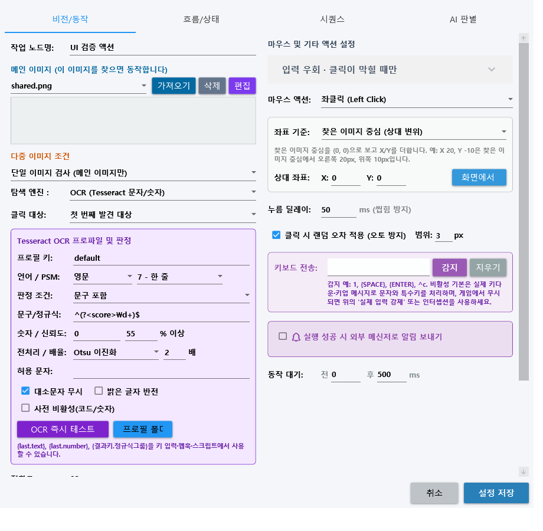
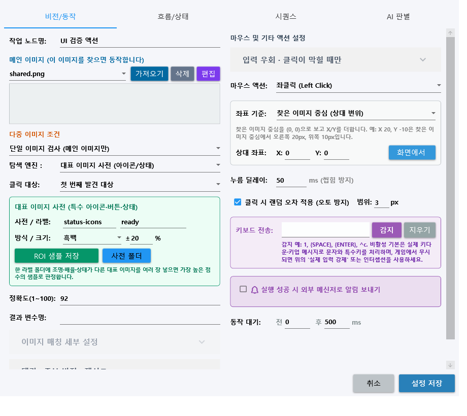
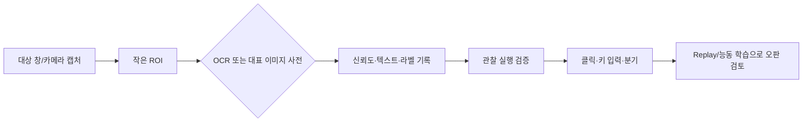

# OCR·대표 이미지 사전 사용 가이드

YoloMacro 1.4.3은 고정 템플릿, YOLO, AOI에 더해 화면의 글자·숫자를 읽는 `OCR`과 라벨별 대표 이미지를 모아 가장 가까운 상태를 판정하는 `대표 이미지 사전`을 제공합니다. 두 기능 모두 대상 창과 설정에서 선택한 카메라 프레임, ROI, 기존 발견/미발견 분기, 클릭·키 입력, Replay·능동 학습 흐름을 그대로 사용합니다.

## 어떤 엔진을 선택해야 하나요?

| 상황 | 권장 엔진 |
|---|---|
| 위치와 모양이 거의 같은 버튼·아이콘 | OpenCV |
| 움직이거나 크기가 달라지는 물체 | YOLO |
| 정상 기준과의 미세한 차이·불량 | AOI |
| 점수, 수량, 날짜, 상태 문구 | OCR |
| `대기/준비/오류`처럼 몇 가지 화면 상태를 예시 이미지로 구분 | 대표 이미지 사전 |

## OCR 액션 만들기

1. 액션을 열고 `탐색 엔진 → OCR`을 선택합니다.
2. 글자가 있는 영역만 ROI로 지정합니다. ROI가 작을수록 빠르고 오인식이 줄어듭니다.
3. 프로필을 선택하거나 만듭니다.
   - `number`: 숫자 한 줄, 이진화, 3배 확대, 숫자 화이트리스트
   - `single-line`: 일반 문장 한 줄
4. 언어를 `kor`, `eng`, 또는 `kor+eng`로 지정합니다. 해당 `traineddata`가 `tessdata`에 있어야 합니다.
5. 판정 방식을 고릅니다.
   - `ReadAny`: 한 글자라도 읽으면 성공
   - `Contains` / `Exact`: 포함 또는 전체 일치
   - `Regex`: 정규식 일치
   - `NumberAtLeast` / `NumberAtMost`: 읽은 첫 숫자를 임계값과 비교
6. `OCR 즉시 테스트`로 실제 캡처 결과, 평균 신뢰도, 숫자를 확인합니다.
7. 관찰 실행으로 분기와 결과 변수를 확인한 뒤 실제 입력을 켭니다.

OCR 결과는 `{last.text}`, `{last.number}`, `{last.confidence}`에 저장됩니다. `결과 변수명`을 `score`로 지정하면 `{score.text}`, `{score.number}`, `{score.confidence}`도 사용할 수 있습니다. 정규식 `^(?<value>\d+)$`처럼 이름 있는 그룹을 쓰면 `{score.value}`로 후속 키 입력·메시지·분기 데이터에 전달됩니다.

## OCR 정확도를 높이는 순서

1. ROI를 텍스트 주변으로 좁힙니다.
2. 숫자라면 허용 문자에 `0123456789.,-%`처럼 실제 문자를 제한합니다.
3. `이진화(Otsu)` 또는 `적응형 이진화`를 비교합니다.
4. 작은 글자는 2~4배 확대합니다.
5. 배경이 어둡고 글자가 밝다면 반전을 시험합니다.
6. 한 줄, 한 단어, 단일 문자에 맞는 PSM을 선택합니다.
7. 실제 운영 캡처를 OK/오인식 사례로 나누어 최소 신뢰도를 조정합니다.

## 대표 이미지 사전 만들기

1. 액션을 열고 `탐색 엔진 → 대표 이미지 사전`을 선택합니다.
2. `사전 키`를 지정합니다. 예: `status-icons`.
3. 현재 상태의 라벨을 입력합니다. 예: `ready`, `busy`, `error`.
4. 상태가 보이는 ROI를 지정한 뒤 `현재 ROI를 샘플로 저장`을 누릅니다.
5. 창 크기, 밝기, 애니메이션 시점이 다른 정상 예시를 라벨마다 여러 장 저장합니다.
6. 특정 라벨만 찾거나, 라벨을 비워 전체 샘플 중 가장 가까운 라벨을 찾도록 설정합니다.
7. 색상 변화가 중요하면 `Color`, 밝기 변화가 많으면 `Gray`, 윤곽이 중요하면 `Edge`를 사용합니다.
8. 화면 배율이 달라질 수 있으면 0~50% 범위의 다중 크기 허용을 지정합니다.

샘플은 프로젝트 작업 공간의 `VisualDictionaries/<사전 키>/<라벨>/`에 저장됩니다. 판정 결과는 `{last.label}` 또는 `{결과키.label}`로 후속 동작에서 사용할 수 있습니다.

## 운영 권장 흐름

- 같은 화면을 반복 실행할 때는 `사라진 뒤 재실행`과 쿨다운을 함께 설정합니다.
- 낮은 신뢰도와 오판 화면은 Replay/능동 학습 검토함에 남겨 ROI, 전처리, 샘플 구성을 개선합니다.
- 고객 화면과 학습 샘플은 Private 소스 또는 현장 프로젝트에만 보관하고 공개 배포 저장소에는 올리지 않습니다.
