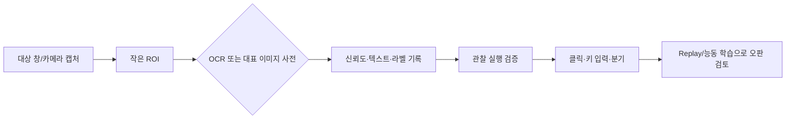

# OCR·대표 이미지 사전 사용 가이드

YoloMacro 1.4.4는 범용 Tesseract OCR, 대상 프로그램 전용 글자 샘플 OCR, 라벨별 대표 이미지를 모아 상태를 판정하는 `대표 이미지 사전`을 제공합니다. 모두 대상 창과 설정에서 선택한 카메라 프레임, ROI, 기존 발견/미발견 분기, 클릭·키 입력, Replay·능동 학습 흐름을 그대로 사용합니다.

## 어떤 엔진을 선택해야 하나요?

| 상황 | 권장 엔진 |
|---|---|
| 위치와 모양이 거의 같은 버튼·아이콘 | OpenCV |
| 움직이거나 크기가 달라지는 물체 | YOLO |
| 정상 기준과의 미세한 차이·불량 | AOI |
| 점수, 수량, 날짜, 상태 문구 | OCR |
| `대기/준비/오류`처럼 몇 가지 화면 상태를 예시 이미지로 구분 | 대표 이미지 사전 |

## OCR 액션 만들기

1. 액션을 열고 `탐색 엔진 → OCR`을 선택합니다.
2. 글자가 있는 영역만 ROI로 지정합니다. ROI가 작을수록 빠르고 오인식이 줄어듭니다.
3. 프로필을 선택하거나 만듭니다.
   - `number`: 숫자 한 줄, 이진화, 3배 확대, 숫자 화이트리스트
   - `single-line`: 일반 문장 한 줄
4. 언어를 `kor`, `eng`, 또는 `kor+eng`로 지정합니다. 해당 `traineddata`가 `tessdata`에 있어야 합니다.
5. 판정 방식을 고릅니다.
   - `ReadAny`: 한 글자라도 읽으면 성공
   - `Contains` / `Exact`: 포함 또는 전체 일치
   - `Regex`: 정규식 일치
   - `NumberAtLeast` / `NumberAtMost`: 읽은 첫 숫자를 임계값과 비교
6. `OCR 즉시 테스트`로 실제 캡처 결과, 평균 신뢰도, 숫자를 확인합니다.
7. 관찰 실행으로 분기와 결과 변수를 확인한 뒤 실제 입력을 켭니다.

OCR 결과는 `{last.text}`, `{last.number}`, `{last.confidence}`에 저장됩니다. `결과 변수명`을 `score`로 지정하면 `{score.text}`, `{score.number}`, `{score.confidence}`도 사용할 수 있습니다. 정규식 `^(?<value>\d+)$`처럼 이름 있는 그룹을 쓰면 `{score.value}`로 후속 키 입력·메시지·분기 데이터에 전달됩니다.

## 대상 프로그램 전용 글자 OCR 만들기

범용 언어 모델이 아니라 게임·설비·앱의 고정 폰트를 직접 등록하려면 다음 순서로 설정합니다.

1. 같은 대상 프로그램과 화면 배율에서 글자 하나만 포함하도록 ROI를 잡습니다.
2. `인식 소스`를 `전용 글자 샘플` 또는 `혼합 자동 선택`으로 지정합니다.
3. `학습 라벨`에 실제 의미를 입력합니다. 숫자라면 `0`부터 `9`까지 각각 등록합니다.
4. `현재 ROI 저장`으로 실제 화면을 누적하거나 `이미지 여러 장`으로 같은 라벨의 기존 캡처를 한꺼번에 가져옵니다.
5. 밝기, 안티앨리어싱, 애니메이션 시점이 다른 정상 샘플을 라벨마다 여러 장 준비합니다.
6. 여러 글자가 있는 실제 ROI로 `OCR 즉시 테스트`를 실행해 조합된 텍스트·숫자·인식 소스를 확인합니다.
7. `혼합`은 전용 신뢰도가 설정값보다 낮을 때 Tesseract를 비교해 더 신뢰도 높은 결과를 사용합니다.

샘플은 `OcrData/<프로필>/GlyphSamples/<라벨>/`에 저장됩니다. 프로필 폴더를 프로젝트와 함께 백업하면 전용 글자 데이터도 같이 복원됩니다. 한 샘플에는 한 글자만 넣는 것이 가장 안정적입니다.

## OCR 결과로 액션 실행

- 특정 글자와 같을 때: `문구 완전 일치`와 예상 문구를 사용합니다.
- 문장 일부가 있을 때: `문구 포함`을 사용합니다.
- 숫자가 기준 이상·이하일 때: `숫자 이상` 또는 `숫자 이하`와 기준값을 사용합니다.
- 여러 형식에서 값을 뽑을 때: 정규식 이름 그룹을 사용합니다.
- 판정 성공 뒤에는 같은 액션의 클릭·키 입력·웹훅·분기 설정이 실행됩니다.

## 움직이는 이미지를 마우스로 따라가기

1. OpenCV 또는 YOLO 등으로 추적을 시작할 대상을 먼저 찾습니다.
2. `마우스 액션 → 대상 따라가기`를 선택합니다.
3. 추적 간격은 일반적으로 20~50ms, 재탐색 반경은 프레임 사이 예상 이동 거리보다 크게 설정합니다.
4. `최대 시간 0`은 대상이 연속 이탈 프레임 수만큼 사라지거나 사용자가 정지할 때까지 계속합니다.
5. 추적기는 최초 이미지의 회색조·외곽선을 지역 검색하고 성공한 화면으로 기준을 갱신하므로 위치·색상이 점진적으로 바뀌는 대상에 적합합니다.

대상이 순간이동하거나 완전히 다른 모양으로 즉시 바뀌는 경우에는 재탐색 반경을 늘리거나, 변화 후 모습도 YOLO 클래스로 학습해 새 검출 액션에서 추적을 다시 시작하세요.

## OCR 정확도를 높이는 순서

1. ROI를 텍스트 주변으로 좁힙니다.
2. 숫자라면 허용 문자에 `0123456789.,-%`처럼 실제 문자를 제한합니다.
3. `이진화(Otsu)` 또는 `적응형 이진화`를 비교합니다.
4. 작은 글자는 2~4배 확대합니다.
5. 배경이 어둡고 글자가 밝다면 반전을 시험합니다.
6. 한 줄, 한 단어, 단일 문자에 맞는 PSM을 선택합니다.
7. 실제 운영 캡처를 OK/오인식 사례로 나누어 최소 신뢰도를 조정합니다.

## 대표 이미지 사전 만들기

1. 액션을 열고 `탐색 엔진 → 대표 이미지 사전`을 선택합니다.
2. `사전 키`를 지정합니다. 예: `status-icons`.
3. 현재 상태의 라벨을 입력합니다. 예: `ready`, `busy`, `error`.
4. 상태가 보이는 ROI를 지정한 뒤 `현재 ROI를 샘플로 저장`을 누릅니다.
5. 창 크기, 밝기, 애니메이션 시점이 다른 정상 예시를 라벨마다 여러 장 저장합니다.
6. 특정 라벨만 찾거나, 라벨을 비워 전체 샘플 중 가장 가까운 라벨을 찾도록 설정합니다.
7. 색상 변화가 중요하면 `Color`, 밝기 변화가 많으면 `Gray`, 윤곽이 중요하면 `Edge`를 사용합니다.
8. 화면 배율이 달라질 수 있으면 0~50% 범위의 다중 크기 허용을 지정합니다.

샘플은 프로젝트 작업 공간의 `VisualDictionaries/<사전 키>/<라벨>/`에 저장됩니다. 판정 결과는 `{last.label}` 또는 `{결과키.label}`로 후속 동작에서 사용할 수 있습니다.

## 운영 권장 흐름

- 같은 화면을 반복 실행할 때는 `사라진 뒤 재실행`과 쿨다운을 함께 설정합니다.
- 낮은 신뢰도와 오판 화면은 Replay/능동 학습 검토함에 남겨 ROI, 전처리, 샘플 구성을 개선합니다.
- 고객 화면과 학습 샘플은 Private 소스 또는 현장 프로젝트에만 보관하고 공개 배포 저장소에는 올리지 않습니다.
