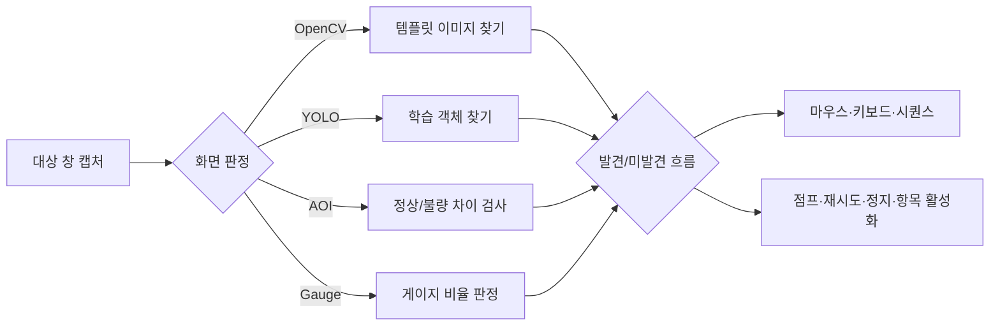

# YoloMacro 전체 사용자 설명서

이 문서는 YoloMacro를 처음 실행하는 단계부터 화면 인식 자동화, AOI 검사, YOLO 데이터 제작과 모델 연결까지 전체 흐름을 안내하는 문서의 시작점입니다. 현재 정식 프로그램 버전은 `1.4.1`입니다.

[한국어](USER_MANUAL.md) · [English](USER_MANUAL_EN.md) · [공개 GitHub Pages 문서](https://ko9ma7.github.io/YoloMacro-Distribution/)

## v1.4.1 시작 화면과 활성화

- 서명된 원격 활성화가 정상이면 프로그램은 항상 `RPA 실행` 화면으로 시작합니다.
- 원격 비활성화, 만료, 서명 오류, 네트워크/응답 오류, 최소 버전 미달인 경우에만 `설정`의 활성화 화면으로 이동합니다.
- 설정의 `다시 확인`이나 업데이트 확인이 성공했을 때는 현재 보고 있던 탭을 유지합니다.
- 비활성 상태에서도 상단 `로컬 진단`으로 핵심 DLL, YOLO 모델, 대상 창과 설정 카메라를 확인할 수 있습니다.
- `GitHub` 버튼은 기본 브라우저로 Private 소스 저장소를 엽니다. 프로그램은 GitHub 비밀번호나 토큰을 저장하지 않습니다.
- 기본 활성화 주소는 `https://ko9ma7.github.io/YoloMacro-Distribution/manifest.json`이며 이전 주소는 자동으로 새 주소로 이전됩니다.

## 문서 지도

| 하고 싶은 일 | 읽을 문서 |
|---|---|
| 설치 후 처음 프로젝트를 만들고 실행하기 | [RPA 실행 완전 가이드](RPA_EXECUTION_GUIDE.md) |
| 정상/불량 샘플로 화면 품질 검사하기 | [AOI 학습과 검사 가이드](AOI_GUIDE.md) |
| 이미지에 박스를 그리고 YOLO 학습·ONNX 연결까지 완료하기 | [YOLO 라벨링·학습·연결 A-Z](YOLO_LABELING_TRAINING_GUIDE.md) |
| 메뉴와 설정을 빠르게 찾아보기 | [전체 기능 참고서](FEATURE_REFERENCE.md) |
| 관찰 실행의 안전 범위 이해하기 | [관찰 실행 안내](OBSERVE_MODE_1.2.1.md) |
| 긴 작업 목록의 `▶`와 따라가기 사용하기 | [작업 목록 표시 안내](RUN_LIST_TRACKING_1.2.2.md) |
| 여러 액션의 설정만 복사하고 Replay 용량 관리하기 | [일괄 설정·창 복구·Replay 관리](BATCH_SETTINGS_AND_REPLAY_1.3.0.md) |
| 프로젝트 파일과 이미지 저장 위치 이해하기 | [프로젝트 저장 구조](project-storage.md) |
| 보안과 업데이트 방식 확인하기 | [보안·업데이트](SECURITY_AND_UPDATE.md) |

## YoloMacro가 하는 일

YoloMacro는 대상 Windows 프로그램의 화면을 캡처하고 현재 상태를 판정한 뒤 설정된 입력과 분기를 실행하는 비전 기반 RPA 도구입니다.

## 처음 사용하는 권장 순서

1. [GitHub Releases](https://github.com/ko9ma7/YoloMacro-Distribution/releases/latest)에서 최신 ZIP을 받습니다.
2. ZIP을 새 폴더에 풀고 `YoloMacro.exe`를 실행합니다.
3. `파일 → 새 프로젝트`로 프로젝트를 만듭니다.
4. `대상 → 타겟 설정`에서 자동화할 창을 선택합니다.
5. 작업 목록의 `A` 또는 `액션 → 액션 추가`로 첫 액션을 만듭니다.
6. 액션을 더블클릭하고 화면 이미지, ROI, 판정 방식, 입력을 설정합니다.
7. `관찰 실행`을 켜고 `실행`하여 화면 판정과 분기를 먼저 확인합니다.
8. 로그와 `▶` 현재 검사 표시가 예상대로 움직이는지 확인합니다.
9. 관찰 실행을 끈 뒤 실제 실행합니다.
10. `파일 → 저장`으로 프로젝트를 저장합니다.

## 화면 구성

YoloMacro의 주 화면은 네 개 탭으로 구성됩니다.

| 탭 | 목적 | 대표 작업 |
|---|---|---|
| RPA 실행 | 실제 자동화 제작과 실행 | 액션/폴더 추가, 관찰 실행, 로그 확인 |
| AOI 학습 | 정상과 불량의 픽셀 차이 학습 | ROI, OK/NG 샘플, 단발 검사 |
| 라벨링 | YOLO용 객체 데이터 제작 | 이미지 추가, 박스/도형, 데이터셋 내보내기 |
| 설정 | 캡처·성능·안전·업데이트 | 캡처 방식, 딜레이, 로그 보존, 안전 제한 |

## 어떤 판정 방식을 선택해야 하나요?

| 상황 | 권장 방식 | 이유 |
|---|---|---|
| 버튼이나 아이콘 모양이 거의 일정함 | OpenCV | 별도 학습 없이 빠르게 적용 가능 |
| 객체 위치·크기·배경이 자주 달라짐 | YOLO | 학습한 객체를 다양한 장면에서 탐지 |
| 고정된 제품/화면의 작은 불량을 찾음 | AOI | 정상 기준과 픽셀 차이로 결함 위치 표시 |
| 체력바·진행률처럼 채워진 비율을 봄 | Gauge | 밝거나 어두운 픽셀 비율 판정 |
| 화면이 장시간 변하지 않는지 확인함 | Frame Stability | 프레임 유사도와 유지 시간 판정 |
| 이미지 규칙으로 설명하기 어려움 | Gemini AI | ROI 또는 전체 화면을 질문으로 판정 |

## 안전한 제작 원칙

- 처음에는 반드시 `관찰 실행`으로 확인합니다.
- ROI는 가능한 작게 지정합니다. 오탐과 CPU 사용을 동시에 줄일 수 있습니다.
- 실제 클릭 전후에 적절한 딜레이를 둡니다.
- 반복 클릭에는 `이미지가 사라지기 전에는 다시 실행하지 않음` 또는 실행 간격 제한을 사용합니다.
- 게임이나 앱플레이어가 일반 입력을 무시할 때만 실제 커서 또는 Interception을 사용합니다.
- DLL 인젝션, 메모리 읽기, 외부 웹훅은 프로젝트 안전 검사에서 권한을 확인한 뒤 사용합니다.
- 중요한 프로젝트는 `파일 → 다른 이름으로 저장`으로 버전별 사본을 남깁니다.

## 빠른 문제 해결

| 증상 | 먼저 확인할 것 |
|---|---|
| 화면이 캡처되지 않음 | 대상 창 선택, 캡처 방식 변경, 최소화 여부 |
| 이미지를 못 찾음 | ROI, 유사도, 현재 배율, 전처리, 캡처 호버 해제 |
| 클릭이 안 됨 | 관찰 실행 여부, 입력 HWND, 활성창 모드, 실제 커서 클릭 |
| 같은 곳을 반복 클릭함 | 사라짐 재무장, 액션 실행 간격, 클릭 반응 확인 |
| 목록이 너무 빠르게 이동함 | `따라가기`를 끄고 `▶` 표시만 사용 |
| AOI가 모두 NG임 | OK 샘플 다양성, 정렬 ROI, 픽셀 차이, 전처리 |
| YOLO가 클래스를 못 찾음 | ONNX 모델, 모델 클래스 정보 등록, 타깃 클래스 철자 |
| YOLO 학습 정확도가 낮음 | 이미지 다양성, 박스 품질, 클래스 균형, train/val 누수 |

## 문서와 구현의 기준

YoloMacro 내부 기능 설명은 이 저장소의 `v1.4.1` 코드와 실제 UI를 기준으로 작성했습니다. YOLO 학습·ONNX 변환 명령은 최신 Ultralytics 공식 문서를 기준으로 하며, 설치된 Ultralytics 버전에 따라 기본 모델 이름이나 옵션이 달라질 수 있습니다.
