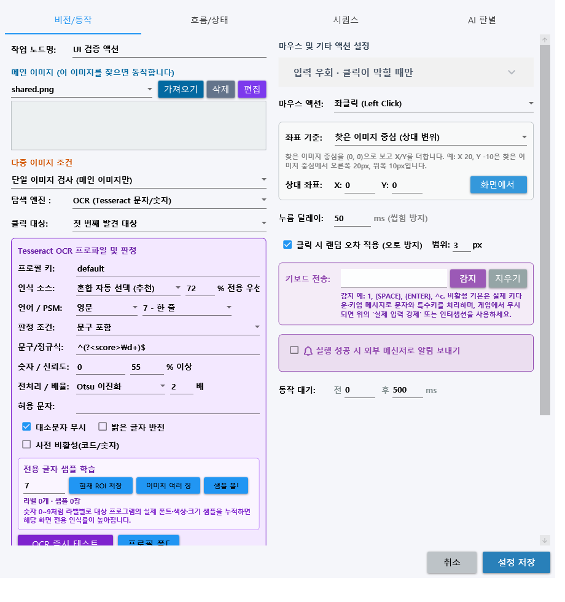
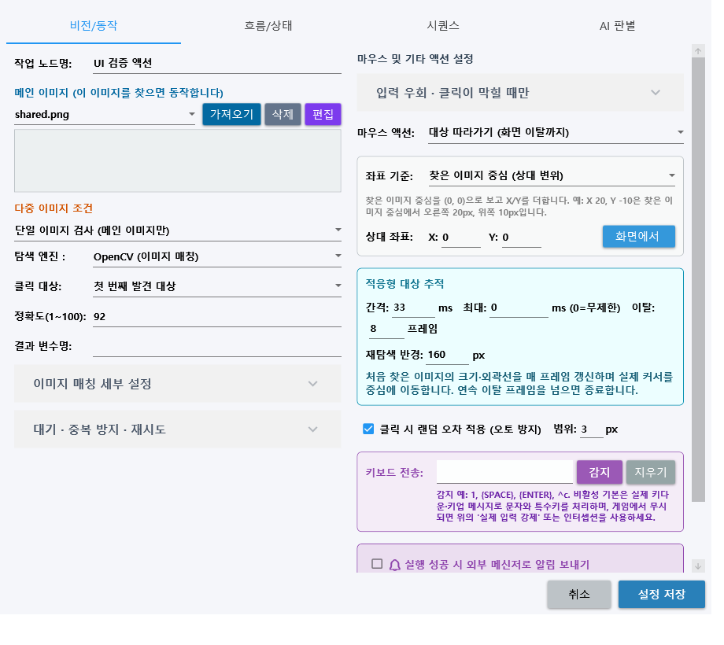

# YoloMacro Distribution

[한국어](#한국어) · [English](#english) · [최신 릴리즈 / Latest release](https://github.com/ko9ma7/YoloMacro-Distribution/releases/latest)

## 한국어

YoloMacro의 공개 배포 전용 저장소입니다. 소스 코드와 내부 구자료는 Private `ko9ma7/YoloMacro`에 보존되며, 이곳에는 검증된 설치 파일·SBOM·서명 활성화 manifest·공개 사용자 문서만 제공합니다.

### 다운로드와 시작

1. [v1.4.4 릴리즈](https://github.com/ko9ma7/YoloMacro-Distribution/releases/tag/v1.4.4)에서 `YoloMacro-v1.4.4-win-x64.zip`을 받습니다.
2. ZIP 전체를 풀고 `YoloMacro.exe`를 실행합니다.
3. 활성화가 정상이면 **RPA 실행** 화면으로 시작합니다. 비활성·만료·서명/네트워크/응답 오류·최소 버전 미달일 때만 **설정**으로 이동합니다.
4. 설정에서 수동으로 `다시 확인`해 성공한 경우에는 현재 탭을 유지합니다.

- [한국어 전체 사용자 설명서](docs/USER_MANUAL.md)
- [OCR·대표 이미지 사전 가이드](docs/OCR_AND_VISUAL_DICTIONARY_GUIDE.md)
- [한국어 원격 활성화·업데이트 가이드](docs/REMOTE_ACTIVATION_AND_UPDATE.md)
- [한국어 v1.4.4 릴리즈 노트](docs/RELEASE_NOTES.v1.4.4.ko.md)

### v1.4.4 전용 OCR과 대상 추적

- 범용 Tesseract, 대상 프로그램 폰트의 라벨별 글자 샘플, 두 결과를 자동 선택하는 혼합 OCR을 제공합니다.
- `0~9`, 영문, 한글 샘플을 프로필에 계속 누적하고 전체 일치·포함·정규식·숫자 이상/이하 조건으로 액션을 실행합니다.
- 처음 찾은 이미지의 회색조와 외곽선을 갱신하며 화면 이탈까지 커서를 따라가게 하는 적응형 추적 액션을 제공합니다.
- 제목과 활성화 배너에서 설치 버전과 구형 단일 DLL 자동업데이트 정책 버전을 구분합니다.
- OCR 네이티브 파일과 언어 데이터가 있으므로 전체 v1.4.4 ZIP을 새 폴더에 풉니다.

## English

This is the public distribution repository for YoloMacro. Private source and historical internal material remain in `ko9ma7/YoloMacro`; this repository contains only verified release packages, SBOM, signed activation manifest, and public documentation.

### Download and start

1. Download `YoloMacro-v1.4.4-win-x64.zip` from the [v1.4.4 release](https://github.com/ko9ma7/YoloMacro-Distribution/releases/tag/v1.4.4).
2. Extract the complete archive and run `YoloMacro.exe`.
3. Valid activation opens **RPA Execution** at application startup. Only a final disabled, expired, signature/network/response error, or minimum-version failure opens **Settings**.
4. A successful manual Retry keeps the current tab.

- [English User Manual](docs/USER_MANUAL_EN.md)
- [OCR and Visual Dictionary Guide](docs/OCR_AND_VISUAL_DICTIONARY_GUIDE_EN.md)
- [English Remote Activation & Update Guide](docs/REMOTE_ACTIVATION_AND_UPDATE_EN.md)
- [English v1.4.4 Release Notes](docs/RELEASE_NOTES_1.4.4_EN.md)

### v1.4.4 custom OCR and tracking

- Choose general Tesseract, target-specific labeled glyph samples, or hybrid automatic selection per OCR profile.
- Accumulate digit, Latin or Hangul samples and use exact/contains/regex/numeric comparisons to trigger existing actions.
- Target Follow updates grayscale and edge templates while moving the pointer until the object is lost.
- The title and activation status distinguish the installed version from the legacy CoreLib-only update-policy version.
- Extract the complete v1.4.4 ZIP into a new folder because OCR includes native runtime and language data.

## Integrity and privacy

The client validates the ECDSA P-256 signed [`manifest.json`](manifest.json). The manifest intentionally keeps the last CoreLib-only compatible updater version while v1.4.4 is distributed as a full ZIP. Do not publish customer images, datasets, API keys, tokens, signing keys, or private source in this repository.
