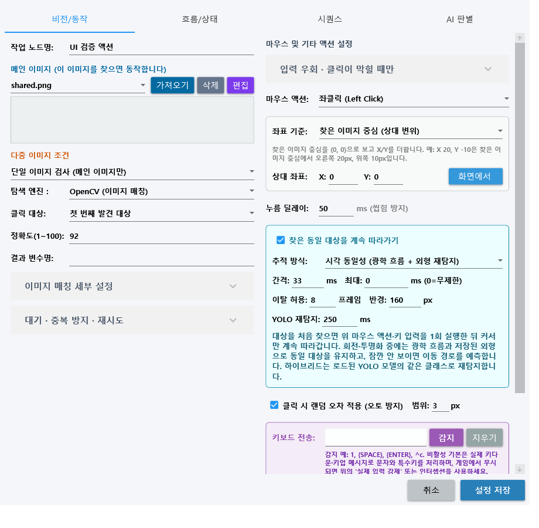

# YoloMacro Distribution

[한국어](#한국어) · [English](#english) · [최신 릴리즈 / Latest release](https://github.com/ko9ma7/YoloMacro-Distribution/releases/latest)

## 한국어

YoloMacro의 공개 배포 전용 저장소입니다. 소스 코드와 내부 구자료는 Private `ko9ma7/YoloMacro`에 보존되며, 이곳에는 검증된 설치 파일·SBOM·서명 활성화 manifest·공개 사용자 문서만 제공합니다.

### 다운로드와 시작

1. [v1.4.5 릴리즈](https://github.com/ko9ma7/YoloMacro-Distribution/releases/tag/v1.4.5)에서 `YoloMacro-v1.4.5-win-x64.zip`을 받습니다.
2. ZIP 전체를 풀고 `YoloMacro.exe`를 실행합니다.
3. 활성화가 정상이면 **RPA 실행** 화면으로 시작합니다. 비활성·만료·서명/네트워크/응답 오류·최소 버전 미달일 때만 **설정**으로 이동합니다.
4. 설정에서 수동으로 `다시 확인`해 성공한 경우에는 현재 탭을 유지합니다.

- [한국어 전체 사용자 설명서](docs/USER_MANUAL.md)
- [OCR·대표 이미지 사전 가이드](docs/OCR_AND_VISUAL_DICTIONARY_GUIDE.md)
- [동일 대상 추적 가이드](docs/TARGET_IDENTITY_TRACKING_GUIDE.md)
- [한국어 원격 활성화·업데이트 가이드](docs/REMOTE_ACTIVATION_AND_UPDATE.md)
- [한국어 v1.4.5 릴리즈 노트](docs/RELEASE_NOTES.v1.4.5.ko.md)

### v1.4.5 동일 대상 추적

- 마우스 클릭·키 입력은 최초 발견 시 기존 설정대로 1회 실행하고, 추적은 독립 옵션으로 커서만 계속 이동합니다.
- 광학 흐름, 저장된 외형 재탐지와 짧은 이동 예측으로 이동·회전·점진 투명화를 같은 대상으로 유지합니다.
- YOLO 하이브리드는 같은 클래스 후보 중 이전 위치·속도·겹침이 맞는 개체를 재결합합니다.
- 완전히 투명한 대상은 직접 관측할 수 없으므로 설정한 유실 허용까지만 예측한 뒤 안전하게 종료합니다.
- OCR·OpenCV·ONNX 네이티브 파일이 있으므로 전체 v1.4.5 ZIP을 새 폴더에 풉니다.

## English

This is the public distribution repository for YoloMacro. Private source and historical internal material remain in `ko9ma7/YoloMacro`; this repository contains only verified release packages, SBOM, signed activation manifest, and public documentation.

### Download and start

1. Download `YoloMacro-v1.4.5-win-x64.zip` from the [v1.4.5 release](https://github.com/ko9ma7/YoloMacro-Distribution/releases/tag/v1.4.5).
2. Extract the complete archive and run `YoloMacro.exe`.
3. Valid activation opens **RPA Execution** at application startup. Only a final disabled, expired, signature/network/response error, or minimum-version failure opens **Settings**.
4. A successful manual Retry keeps the current tab.

- [English User Manual](docs/USER_MANUAL_EN.md)
- [OCR and Visual Dictionary Guide](docs/OCR_AND_VISUAL_DICTIONARY_GUIDE_EN.md)
- [Same-target Tracking Guide](docs/TARGET_IDENTITY_TRACKING_GUIDE_EN.md)
- [English Remote Activation & Update Guide](docs/REMOTE_ACTIVATION_AND_UPDATE_EN.md)
- [English v1.4.5 Release Notes](docs/RELEASE_NOTES_1.4.5_EN.md)

### v1.4.5 same-target tracking

- Mouse/key input runs once according to the existing action, while continuous cursor following is enabled independently.
- Optical flow, an appearance bank and bounded motion prediction maintain identity through motion, rotation and gradual fading.
- Hybrid YOLO re-associates the most plausible same-class detection using predicted position and overlap.
- A fully invisible object has no visual evidence; prediction stops after the configured lost-frame limit.
- Extract the complete v1.4.5 ZIP into a new folder because OCR and vision features include native runtime assets.

## Integrity and privacy

The client validates the ECDSA P-256 signed [`manifest.json`](manifest.json). The manifest intentionally keeps the last CoreLib-only compatible updater version while v1.4.5 is distributed as a full ZIP. Do not publish customer images, datasets, API keys, tokens, signing keys, or private source in this repository.
